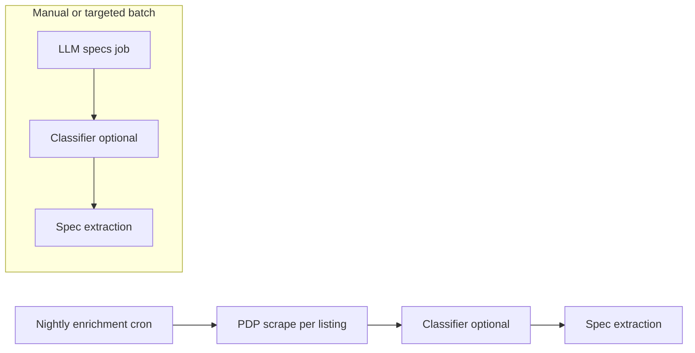

# Separate LLM spec determination (revised plan)

## Feasibility (unchanged)

LLM category classification + LLM spec extraction already use **Postgres only** (`product_name`, `metadata.specs`, `metadata.description`, `canonical_category`) plus OpenAI—not the scraper. Full enrichment wires scraper → `UpdateListingEnrichment` → then those LLM steps ([`scheduler.go`](apps/api/internal/scheduler/scheduler.go)). **Separation is an orchestration and product-surface gap**, not an architectural blocker.

Existing **“Re-classify only (LLM)”** in [Operations.tsx](apps/web/src/admin/Operations.tsx) triggers batch **category classification** via `classifyRunMutation`; it does **not** substitute for running **prompt-profile spec extraction**. A dedicated “LLM specs” operation is still required for your testing workflow.

---

## 1) Admin UI (explicit requirement)

The original sketch did not insist on UI; **this iteration treats admin UI as in-scope** so manual testing is easy.

**Target surfaces** (mirror existing enrich/classify patterns):

| Surface                                                                                     | Behavior                                                                                                                                                                                                                                                                               |
| ------------------------------------------------------------------------------------------- | -------------------------------------------------------------------------------------------------------------------------------------------------------------------------------------------------------------------------------------------------------------------------------------- |
| [Operations.tsx](apps/web/src/admin/Operations.tsx)                                         | Add a third radio alongside “Re-enrich (PDP + LLM)” and “Re-classify only (LLM)”, e.g. **“LLM specs only”** — same filters as today (store, canonical path, LLM confidence &lt;) where applicable; calls new batch endpoint. Clarify helper copy — classify vs. specs vs. full enrich. |
| [DataBrowser.tsx](apps/web/src/admin/DataBrowser.tsx)                                       | Per-row / detail panel action **“Run LLM specs”** + optional bulk modal (reuse patterns from bulk enrich / classify).                                                                                                                                                                  |
| [api.ts](apps/web/src/admin/api.ts) + [mutations.ts](apps/web/src/admin/hooks/mutations.ts) | New `triggerLLMSpecs` / single-listing `/admin/listings/:id/...` helpers; invalidate listing queries on success.                                                                                                                                                                       |
| [PromptProfileManager.tsx](apps/web/src/admin/PromptProfileManager.tsx)                     | Short note that iterating profiles can use “LLM specs only” instead of full enrich.                                                                                                                                                                                                    |

**Optional:** Dashboard / per-store chips—only add if Operations + DataBrowser are enough for your cadence.

**Analytics:** If new buttons are primary triggers, decide per [.cursor/rules/posthog-analytics.mdc](.cursor/rules/posthog-analytics.mdc) whether to capture events (often one event name with `route: ops|browser`).

---

## 2) Where this fits in automated workflow

- **Scheduled PDP enrichment:** Keep as today. Each newly enriched listing still runs classify + extract afterward so listings stay coherent **without** a second cron.
- **Spec-only on a timer for _all_ listings:** Usually **low value**. It repeats work using the **same** `metadata.specs` unless profiles/prompts changed; burns tokens proportional to catalogue size.
- **When recurring spec-only _does_ make sense:** Narrow jobs—e.g. “listings matching category X”, “`llm_confidence_below`”, or **after deploying profile/schema changes** (one-off or short-lived cron), not blindly every night alongside enrich.

**Recommendation:** Treat **LLM specs-only** as **primary operator workflow: manual / filtered batch** via admin UI (+ optional **`llm-specs-now`** with query params mirroring classify for automation). Cron for global spec-only is optional and should be deliberate (cost vs. freshness).

---

## Implementation notes (concise)

- Share pipeline with scheduler + admin enrich path (`runLLMCategoryClassification` → `runLLMExtractionIfApplicable` semantics, quota handling from scheduler).
- Guardrails: skip or warn when `metadata.specs` is empty (no PDP data to extract from).
- `MergeLLMSpecs` already respects `llm_overrides` on rerun.

---

## Docs

Per workspace rules: [apps/api/README.md](apps/api/README.md), [docs/ARCHITECTURE.md](docs/ARCHITECTURE.md); [apps/web/README.md](apps/web/README.md) if analytics/contracts change.
