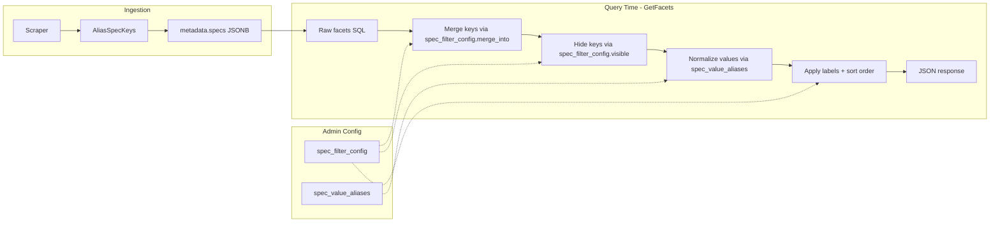

# Spec Filter Normalization System

## Problem

Three issues with spec filter data today:

1. **Duplicate keys** -- "Available Diameters" and "Diameter" appear as separate filters (should merge)
2. **Unwanted keys** -- "Useful Links" shows as a filter (should be hidden)
3. **Duplicate values** -- "15x110mm Boost", "15x110mm BOOST(TM)", "15x110mm" appear as separate options (should normalize)

## Current Architecture

Specs are stored in `store_listings.metadata->'specs'` as a flat `{key: value}` JSONB object. At enrichment time, raw spec keys are aliased to canonical keys via a hardcoded `specKeyAliases` list in [apps/api/internal/metadata/normalize.go](apps/api/internal/metadata/normalize.go). Values pass through **unchanged**. The `/facets` endpoint dynamically discovers all spec keys/values from the DB and returns them as facets -- there is no visibility control, no value normalization, and key aliasing only works for future enrichments (not existing data).

## Design

Two new DB tables for admin-managed configuration, applied at **query time** in Go (after the existing SQL query returns raw facets). This preserves raw data in the DB while giving full control over what the user sees.



### Table 1: `spec_filter_config`

Controls key visibility, merging, labeling, and ordering.

```sql
CREATE TABLE spec_filter_config (
  id SERIAL PRIMARY KEY,
  spec_key VARCHAR(100) NOT NULL UNIQUE,
  visible BOOLEAN NOT NULL DEFAULT true,
  merge_into VARCHAR(100),        -- merge this key's values into another key's facet
  display_label VARCHAR(200),     -- override label (NULL = auto from SpecKeyToLabel)
  sort_order INT NOT NULL DEFAULT 0,  -- higher = shown first
  created_at TIMESTAMPTZ DEFAULT NOW(),
  updated_at TIMESTAMPTZ DEFAULT NOW()
);
```

- To hide "Useful Links": `INSERT INTO spec_filter_config (spec_key, visible) VALUES ('useful_links', false)`
- To merge "Available Diameters" into "Diameter": `INSERT INTO spec_filter_config (spec_key, merge_into) VALUES ('available_diameters', 'diameter')`
- Keys **not** in this table default to current behavior (visible, auto-label, sort by product count)

### Table 2: `spec_value_aliases`

Normalizes raw values to display values per spec key.

```sql
CREATE TABLE spec_value_aliases (
  id SERIAL PRIMARY KEY,
  spec_key VARCHAR(100) NOT NULL,
  raw_value VARCHAR(500) NOT NULL,
  display_value VARCHAR(500) NOT NULL,
  created_at TIMESTAMPTZ DEFAULT NOW(),
  UNIQUE(spec_key, raw_value)
);
```

- To normalize axle values: three rows mapping `15x110mm BOOST(TM)`, `15x110mm`, and `15x110mm Boost` all to display_value `15x110mm Boost`
- When building facets, values mapping to the same `display_value` have their counts summed

### Query-Time Application (Go code)

Modify `GetFacets` in [apps/api/internal/db/specs.go](apps/api/internal/db/specs.go):

1. Run existing SQL to get raw `(key, value, count)` tuples (unchanged)
2. Load `spec_filter_config` and `spec_value_aliases` into memory (small tables, can cache)
3. **Key merging**: For each tuple, if `merge_into` is set for the key, reassign key to the merge target
4. **Key filtering**: Drop tuples whose final key has `visible = false`
5. **Value normalization**: Replace value with `display_value` from alias table (case-insensitive match)
6. **Re-aggregate**: Group by `(final_key, final_value)`, sum counts
7. **Label + sort**: Apply `display_label` and `sort_order` from config; unconfigured keys use existing auto-label logic, sorted by product count

### Filter Expansion for `/deals`

When a user filters by a normalized display value (e.g., `spec_axle=15x110mm Boost`), modify `GetDeals` in [apps/api/internal/db/db.go](apps/api/internal/db/db.go) to expand the filter to match **all raw values** that map to that display value:

```sql
-- Instead of: AND metadata->'specs'->>'axle' ILIKE '15x110mm Boost'
-- Expand to:  AND metadata->'specs'->>'axle' ILIKE ANY(ARRAY['15x110mm Boost', '15x110mm BOOST™', '15x110mm'])
```

### Config Loading

New file `apps/api/internal/specfilter/config.go`:

- `LoadConfig(ctx, db)` -- loads both tables into Go structs
- `ApplyToFacets(rawFacets, config)` -- applies merging, filtering, value normalization
- `ExpandFilterValues(specFilters, config)` -- expands filter values for deal queries
- Called from `GetFacets` and `GetDeals`; config reloaded per request (tables are tiny) or cached with short TTL

### Additional Ingestion-Time Aliases

Extend the hardcoded `specKeyAliases` in [apps/api/internal/metadata/normalize.go](apps/api/internal/metadata/normalize.go) with common missing aliases (e.g., `"available diameter" -> "diameter"`, `"seatpost diameter" -> "diameter"`). This reduces the need for query-time merging over time.

### Re-normalize Backfill

Add an admin endpoint `POST /admin/renormalize-specs` that iterates all listings and re-applies `AliasSpecKeys` to their stored `metadata.specs`, fixing historical key normalization without re-scraping PDPs. Similar pattern to the existing "Re-categorize" flow.

### Admin API Endpoints

New endpoints in [apps/api/internal/api/handlers.go](apps/api/internal/api/handlers.go):

- `GET /admin/spec-filter-config` -- list all config rows
- `POST /admin/spec-filter-config` -- create
- `PUT /admin/spec-filter-config/:id` -- update
- `DELETE /admin/spec-filter-config/:id` -- delete
- `GET /admin/spec-value-aliases` -- list all alias rows (filterable by spec_key)
- `POST /admin/spec-value-aliases` -- create
- `PUT /admin/spec-value-aliases/:id` -- update
- `DELETE /admin/spec-value-aliases/:id` -- delete
- `GET /admin/spec-keys` -- discover all spec keys in DB with product counts (for admin to see what exists)
- `POST /admin/renormalize-specs` -- re-apply key aliases to all listings

### Admin UI

New page at `/admin/spec-filters` in [apps/web/src/admin/](apps/web/src/admin/), following the pattern of [TaxonomyManager.tsx](apps/web/src/admin/TaxonomyManager.tsx):

- **Spec Keys table**: Shows all discovered keys, their current config (visible, merge_into, label, sort_order), and edit/toggle controls
- **Value Aliases section**: When a key is selected, shows its raw values and any alias mappings; inline create/edit
- **Re-normalize button**: Triggers backfill of key aliases on existing data
- Add "Spec Filters" link to admin nav in `AdminLayout.tsx`

## Files to Create/Modify

**New files:**

- `packages/shared/migrations/011_spec_filter_config.sql` -- migration
- `apps/api/internal/specfilter/config.go` -- config loading + application logic
- `apps/web/src/admin/SpecFilterManager.tsx` -- admin UI

**Modified files:**

- `apps/api/internal/db/specs.go` -- integrate config into `GetFacets`
- `apps/api/internal/db/db.go` -- integrate filter expansion into `GetDeals`, add CRUD methods
- `apps/api/internal/api/handlers.go` -- new admin endpoints
- `apps/api/main.go` -- register new routes
- `apps/api/internal/metadata/normalize.go` -- add missing key aliases
- `apps/web/src/admin/AdminLayout.tsx` -- add nav link
- `apps/web/src/admin/api.ts` -- admin API functions
- `apps/web/src/admin/hooks/queries.ts` -- query hooks
- `apps/web/src/admin/hooks/mutations.ts` -- mutation hooks
