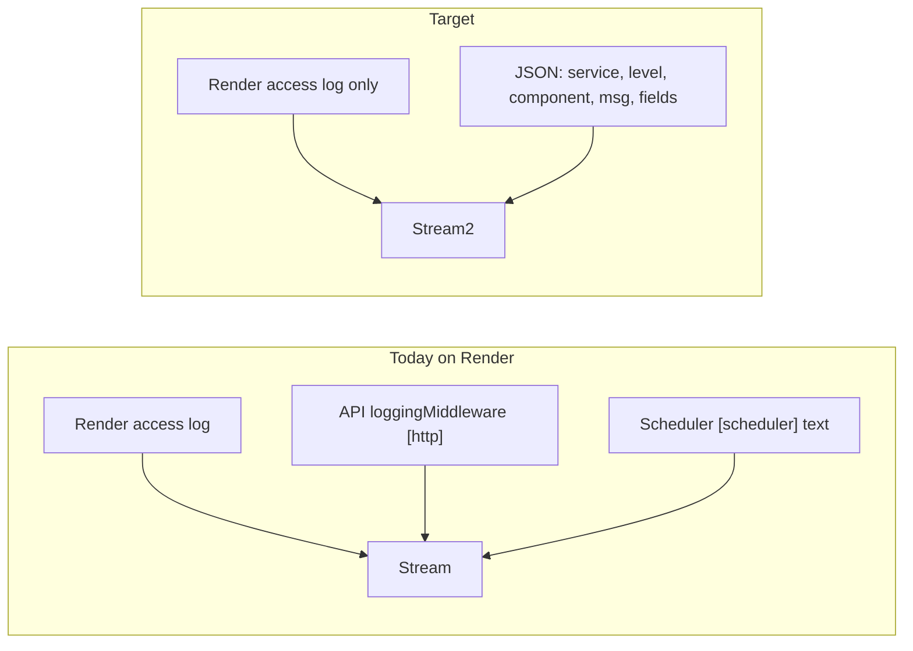

# Standardized JSON Logging

## Problem

Your Render sample shows **two access-log lines per request**:

1. **Render platform** (rich): `clientIP`, `requestID`, `responseTimeMS`, `responseBytes`, full URL with query
2. **App middleware** in [`apps/api/main.go`](apps/api/main.go): `[http] 10.25.145.246:59600 GET /deals/7305 200 200ms`

The app line adds noise without new signal (proxy `RemoteAddr`, no query string, no request ID). Background jobs use inconsistent `[tag]` text prefixes with no levels or parseable fields.



## Log contract (all apps)

One JSON object per line to stdout/stderr. Stable field names for filters in Render, Datadog, etc.

| Field         | Required       | Example                                        |
| ------------- | -------------- | ---------------------------------------------- |
| `ts`          | yes            | `2026-05-20T22:32:51.123Z` (RFC3339 ms)        |
| `level`       | yes            | `info` / `warn` / `error` / `debug`            |
| `service`     | yes            | `api` / `scraper` / `web`                      |
| `component`   | yes            | `http` / `scheduler` / `enrichment` / `parser` |
| `msg`         | yes            | Human-readable summary                         |
| `request_id`  | when available | From `X-Request-Id` or generated UUID          |
| `duration_ms` | for timed ops  | `202`                                          |
| `store`       | scrape/enrich  | `jensonusa`                                    |
| `listing_id`  | enrichment     | `7305`                                         |
| `err`         | on errors      | Error message string                           |
| `status`      | HTTP           | `200`                                          |

**Local dev:** `LOG_FORMAT=text` renders the same fields as a compact single line (optional; JSON remains default).

**Env vars** (add to [`.env.example`](.env.example)):

- `LOG_LEVEL` — `debug` / `info` / `warn` / `error` (default `info`)
- `LOG_FORMAT` — `json` (default) or `text`
- `LOG_HTTP_ACCESS` — `auto` (default): off when `RENDER=true` or `VERCEL=1`, on locally; `on` / `off` to override

## HTTP access logging policy

**Do not duplicate platform access logs in production.**

| Environment  | HTTP access logs                                                                                         |
| ------------ | -------------------------------------------------------------------------------------------------------- |
| Render (API) | Rely on Render; **remove** current `loggingMiddleware` output when `LOG_HTTP_ACCESS=auto` detects Render |
| Vercel (web) | Rely on Vercel; no new access middleware                                                                 |
| Local dev    | Optional single structured access line via middleware (includes query string, status, duration)          |

When app access logging is enabled locally, skip `/health` to avoid probe noise.

## Implementation by app

### 1. Go API — `slog` + `internal/logutil`

Create [`apps/api/internal/logutil/logutil.go`](apps/api/internal/logutil/logutil.go):

- `Init(service string)` — reads `LOG_LEVEL`, `LOG_FORMAT`; configures `slog` JSON or text handler
- `Logger(component string) *slog.Logger` — child logger with `component` bound
- `ClientIP(r *http.Request) string` — `X-Forwarded-For` first hop, else `RemoteAddr`
- `RequestID(r *http.Request) string` — read `X-Request-ID` / Render `Rndr-Id` or generate

Replace [`loggingMiddleware`](apps/api/main.go) with structured access logging gated by `LOG_HTTP_ACCESS`:

```go
// Only when access logging enabled; always skip /health
logger.Info("request",
  "method", r.Method,
  "path", r.URL.Path,
  "query", r.URL.RawQuery, // omit when empty
  "status", rec.status,
  "duration_ms", elapsed.Milliseconds(),
  "client_ip", logutil.ClientIP(r),
  "request_id", logutil.RequestID(r),
)
```

**Migration order** (highest signal first):

1. [`main.go`](apps/api/main.go) — startup, shutdown, security, cron triggers (~15 calls)
2. [`internal/scheduler/scheduler.go`](apps/api/internal/scheduler/scheduler.go) — scrape/enrich jobs (~63 calls); reduce per-listing `info` noise to `debug` (e.g. `listing %d: category_path=`)
3. [`internal/api/handlers*.go`](apps/api/internal/api/handlers.go) — replace `[api]` / `[admin]` errors
4. Remaining tagged logs (`impact`, `llmlisting`, `cmd/*`) as encountered

Keep `log.Fatal` for process exit; route everything else through `slog`.

### 2. Scraper — `pino` + shared Node package

Create [`packages/logging`](packages/logging):

- `@mtb-aggregator/logging` — thin wrapper around **pino**
- Exports `createLogger({ service, component })`, `logHttpAccess(req, res, durationMs)`, level/format from env
- Maps pino levels to contract field names (`ts`, `level`, `service`, `component`, `msg`)

Wire in [`apps/scraper/src/server.ts`](apps/scraper/src/server.ts):

- Replace `console.log/warn/error` in routes with structured logger
- Add optional Express access middleware (same `LOG_HTTP_ACCESS` rules; skip `/health`)
- Fix gap: call `captureRouteError` on `/enrich` 5xx (align with Sentry policy)

Parser files (`console.log` in parsers): **phase 2** — migrate high-traffic parsers only when touched; new logs use the shared logger.

### 3. Web — minimal server-side logging

Next.js on Vercel already logs HTTP. Scope is small:

- Add `@mtb-aggregator/logging` dependency
- Use in [`apps/web/src/instrumentation.ts`](apps/web/src/instrumentation.ts) for startup/config messages only
- Replace stray `console.error` in admin code with `logger.error` + keep Sentry capture where policy requires
- No HTTP access middleware on web

### 4. Documentation

Add [`docs/LOGGING.md`](docs/LOGGING.md) — schema, env vars, examples, Render filtering tips (`level:error`, `component:scheduler`, `service:api`).

Update per documentation-sync rule:

- [`docs/ARCHITECTURE.md`](docs/ARCHITECTURE.md) — Observability section
- [`CLAUDE.md`](CLAUDE.md) — env vars + logging pointer
- [`.env.example`](.env.example) — `LOG_LEVEL`, `LOG_FORMAT`, `LOG_HTTP_ACCESS`
- App READMEs: brief “Logging” subsection pointing to `docs/LOGGING.md`

## Example output (after)

**Render access log** (unchanged, one line per request):

```
[GET] mtb-aggregator-api.onrender.com/deals/7305 clientIP="52.176.125.113" requestID="355a99c1-..." responseTimeMS=202 ...
```

**App business log** (no duplicate HTTP line):

```json
{
  "ts": "2026-05-20T22:32:51.123Z",
  "level": "info",
  "service": "api",
  "component": "scheduler",
  "msg": "scrape completed",
  "store": "jensonusa",
  "count": 142,
  "duration_ms": 8420
}
```

**Local dev with access logging on:**

```json
{
  "ts": "...",
  "level": "info",
  "service": "api",
  "component": "http",
  "msg": "request",
  "method": "GET",
  "path": "/deals/7305",
  "status": 200,
  "duration_ms": 200,
  "client_ip": "127.0.0.1"
}
```

## Render readability tips (document in LOGGING.md)

- Filter out platform noise: search `service:api` or `-component:http` if any access logs remain
- Errors only: `level:error`
- Job debugging: `component:scheduler` OR `component:enrichment`
- Correlate with Render: match app `request_id` to Render `requestID` when both present

## Out of scope (follow-ups)

- Log drain to external SIEM
- OpenTelemetry traces
- Migrating every parser `console.log` in one PR
- Changing Sentry event format (stays separate from stdout logs)

## Verification

- Run API locally with `LOG_FORMAT=text` and `LOG_HTTP_ACCESS=on` — confirm one access line per request, `/health` silent
- Run with `LOG_FORMAT=json` — pipe through `jq` to validate schema
- Deploy to Render — confirm HTTP volume drops ~50% (duplicate lines gone); scheduler scrape logs parse as JSON
- Scraper: trigger `make scrape-now-wwc` and confirm structured start/complete lines with `store`, `count`, `duration_ms`
