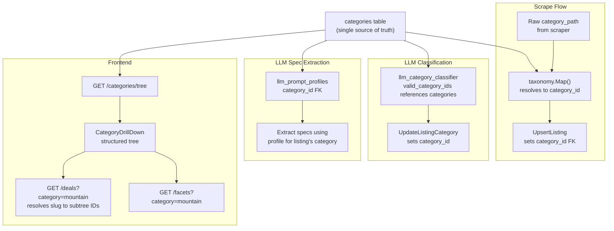

# Structured Category System

## Problem

Categories are bare `TEXT[]` arrays duplicated across 6 locations with no enforced consistency. The homepage already has drift (`Components > Shocks` doesn't exist in the taxonomy). Parent-level filtering (`WHERE canonical_category = ARRAY['Bikes']`) doesn't include children -- a fundamental limitation.

## Progress

**Completed (Steps 1, 3, 4):**

- **Migration 017** applied: `categories` table with `id`, `slug`, `name`, `parent_id`, `sort_order`, `depth`, timestamps. Seed: 24 categories (4 roots + 20 children). Slug format: globally unique hyphenated paths (e.g. `bikes-mountain`, `components-drivetrain`).
- **DB layer** [apps/api/internal/db/categories.go](apps/api/internal/db/categories.go): `ListCategories`, `ListCategoriesTree`, `GetCategoryByID`, `GetCategoryBySlug`, `CreateCategory`, `UpdateCategory`, `DeleteCategory`. Tree built on-demand from flat list (no in-memory cache yet).
- **API**: `GET /categories/tree` (public); `GET/POST /admin/categories`, `GET/PUT/DELETE /admin/categories/:id` (admin). Handlers in [apps/api/internal/api/handlers_categories.go](apps/api/internal/api/handlers_categories.go).

**Deviations from plan:**

- Slugs are globally unique (`bikes-mountain`) instead of `(parent_id, slug)` uniqueness; simpler and works for URL params.
- Added `depth` column. No `description` column.
- `PUT /admin/categories/reorder` (batch sort_order) not yet implemented; single-node `UpdateCategory` includes `sort_order`.
- No `internal/category/` package with cached tree; DB queried per request. Can add cache later if needed.

**Completed (Step 2):**

- **Migration 018** applied: Added nullable `category_id` FK to store_listings, category_mappings, llm_prompt_profiles; added `valid_category_ids INTEGER[]` to llm_category_classifier. Backfilled all via recursive CTE matching canonical paths to category tree. Index on store_listings(category_id).

**Next:** Step 5 (migrate Go queries to use category_id).

## Design

### New `categories` Table (adjacency list)

```sql
CREATE TABLE categories (
  id SERIAL PRIMARY KEY,
  slug VARCHAR(100) NOT NULL,
  name VARCHAR(200) NOT NULL,
  parent_id INTEGER REFERENCES categories(id) ON DELETE RESTRICT,
  sort_order INTEGER NOT NULL DEFAULT 0,
  description TEXT,
  created_at TIMESTAMPTZ NOT NULL DEFAULT NOW(),
  updated_at TIMESTAMPTZ NOT NULL DEFAULT NOW()
);
CREATE UNIQUE INDEX idx_categories_parent_slug
  ON categories (COALESCE(parent_id, 0), slug);
CREATE INDEX idx_categories_parent_id ON categories(parent_id);
```

Globally unique slugs enforced via `COALESCE(parent_id, 0)`. Tree is tiny (~20 nodes), loaded into Go memory on startup.

### Seed Data (from existing taxonomy)

```
Bikes (slug: bikes, sort: 1)
  ├─ Electric (slug: electric, sort: 1)
  ├─ Mountain (slug: mountain, sort: 2)
  ├─ Gravel (slug: gravel, sort: 3)
  ├─ Road (slug: road, sort: 4)
  └─ Kids (slug: kids, sort: 5)
Components (slug: components, sort: 2)
  ├─ Drivetrain (slug: drivetrain, sort: 1)
  ├─ Brakes (slug: brakes, sort: 2)
  ├─ Suspension (slug: suspension, sort: 3)
  ├─ Wheels (slug: wheels, sort: 4)
  └─ Cockpit (slug: cockpit, sort: 5)
Gear (slug: gear, sort: 3)
  ├─ Helmets (slug: helmets, sort: 1)
  ├─ Protection (slug: protection, sort: 2)
  ├─ Clothing (slug: clothing, sort: 3)
  └─ Shoes (slug: shoes, sort: 4)
Accessories (slug: accessories, sort: 4)
  ├─ Tools (slug: tools, sort: 1)
  ├─ Bags (slug: bags, sort: 2)
  └─ Lights (slug: lights, sort: 3)
```

### FK Migration Strategy

Add nullable `category_id` columns alongside existing `TEXT[]`, backfill in SQL using a recursive CTE to match paths, then update all queries. Old columns can be dropped in a final cleanup step (separate migration later).

### Data flow after migration



### URL / Filter Params

Frontend switches from `?canonical_category=Bikes%20%3E%20Mountain` to `?category=mountain` (slug). The API resolves the slug to an ID and queries the subtree -- selecting "Bikes" now correctly includes all child categories (Electric, Mountain, Gravel, etc.).

---

## Implementation Steps

### Step 1: Migration -- `categories` table + seed

**File:** `packages/shared/migrations/017_categories_table.sql`

- CREATE TABLE with adjacency list schema (see above)
- INSERT seed data for all 20 categories derived from `category_taxonomy.json`
- Use `currval`/subqueries to set `parent_id` references

### Step 2: Migration -- add `category_id` FKs + backfill

**File:** `packages/shared/migrations/018_category_id_fks.sql`

- `ALTER TABLE store_listings ADD COLUMN category_id INTEGER REFERENCES categories(id)`
- `ALTER TABLE category_mappings ADD COLUMN category_id INTEGER REFERENCES categories(id)`
- `ALTER TABLE llm_prompt_profiles ADD COLUMN category_id INTEGER REFERENCES categories(id)`
- Add `valid_category_ids INTEGER[]` to `llm_category_classifier`
- Backfill all four using a recursive CTE that builds `TEXT[] -> id` mapping:

```sql
WITH RECURSIVE cat_tree AS (
  SELECT id, slug, name, parent_id, ARRAY[name] AS path
  FROM categories WHERE parent_id IS NULL
  UNION ALL
  SELECT c.id, c.slug, c.name, c.parent_id, ct.path || c.name
  FROM categories c JOIN cat_tree ct ON c.parent_id = ct.id
)
UPDATE store_listings sl SET category_id = ct.id
FROM cat_tree ct WHERE sl.canonical_category = ct.path;
```

- Similar UPDATE for `category_mappings`, `llm_prompt_profiles`
- Populate `valid_category_ids` from `valid_categories` JSONB
- Create index: `CREATE INDEX idx_store_listings_category_id ON store_listings(category_id)`

### Step 3: Go category package + in-memory tree

**New files:**

- `apps/api/internal/category/tree.go` -- `CategoryNode` struct, `Tree` with `LoadFromDB`, `Subtree(id)`, `FindBySlug(slug)`, `FindByPath([]string)`, `ToJSON()` methods
- `apps/api/internal/db/categories.go` -- CRUD: `ListCategories`, `CreateCategory`, `UpdateCategory`, `DeleteCategory`, `GetCategoryBySlug`, `GetCategorySubtreeIDs`

**Modify:**

- [apps/api/main.go](apps/api/main.go) -- load category tree on startup, refresh on mutations

The tree is cached in memory (20 nodes). `Subtree(id)` returns all descendant IDs for WHERE IN queries. `FindBySlug` resolves URL params.

### Step 4: Category API endpoints

**Modify:** [apps/api/internal/api/handlers.go](apps/api/internal/api/handlers.go) or new `handlers_categories.go`

Public:

- `GET /categories/tree` -- returns full tree as nested JSON (replaces `/canonical-categories` eventually)

Admin:

- `POST /admin/categories` -- create node (name, slug, parent_id, sort_order)
- `PUT /admin/categories/:id` -- update name, slug, sort_order, parent_id (move)
- `DELETE /admin/categories/:id` -- delete leaf node (reject if has children or listings)
- `PUT /admin/categories/reorder` -- batch update sort_order

Wire routes in [apps/api/main.go](apps/api/main.go).

### Step 5: Migrate core Go queries to `category_id`

**Modify:** [apps/api/internal/db/db.go](apps/api/internal/db/db.go)

- `GetDeals`: accept `CategoryID` or `CategorySlug` param; resolve slug to ID; use `WHERE sl.category_id = ANY($n)` with subtree IDs (fixes parent-category filtering)
- `GetAdminListings`: same pattern
- `UpsertListing`: write `category_id` (resolve from taxonomy result)
- `UpdateListingEnrichment`: write `category_id`
- `GetCanonicalCategories`: rewrite to query `categories` table with counts (`SELECT c.id, ... COUNT(sl.id)`) or deprecate in favor of `/categories/tree`

**Modify:** [apps/api/internal/db/specs.go](apps/api/internal/db/specs.go)

- `GetFacets` / `buildFacetsWhereClause`: use `category_id` for filtering; look up LLM profile by `category_id`

**Modify:** [apps/api/internal/db/llm_profiles.go](apps/api/internal/db/llm_profiles.go)

- `GetLLMPromptProfileForCategory`: change from `WHERE canonical_category = $1` to `WHERE category_id = $1`

**Modify:** [apps/api/internal/db/category_classifier.go](apps/api/internal/db/category_classifier.go)

- `UpdateListingCanonicalCategory` -> `UpdateListingCategory`: set `category_id` instead of `canonical_category`
- Classifier reads `valid_category_ids` and maps them to category paths for the LLM prompt

**Modify:** [apps/api/internal/taxonomy/taxonomy.go](apps/api/internal/taxonomy/taxonomy.go)

- `Map()` returns `category_id int` instead of `[]string` (or a wrapper that does both during transition)

**Modify:** `category_mappings` CRUD in db.go -- use `category_id` FK

### Step 6: Frontend -- structured categories + admin

**Modify:** [apps/web/src/api.ts](apps/web/src/api.ts)

- New `Category` type: `{ id, slug, name, parentId, sortOrder, children, path, listingCount }`
- `fetchCategoryTree()` -> `GET /categories/tree`
- Update `fetchDeals`, `fetchFacets` params to use `category` (slug) instead of `canonical_category`

**Modify:** [apps/web/src/hooks/queries.ts](apps/web/src/hooks/queries.ts)

- `useCategoryTree()` replaces `useCanonicalCategories()`
- Category mutation hooks for admin CRUD

**Modify:** [apps/web/src/hooks/useFilterParams.ts](apps/web/src/hooks/useFilterParams.ts)

- Switch from `canonical_category` to `category` (slug) URL param

**Modify:** [apps/web/src/components/CategoryDrillDown.tsx](apps/web/src/components/CategoryDrillDown.tsx)

- Accept structured `Category[]` tree instead of flat string array
- Remove `buildTree` string parsing -- tree comes pre-built from API
- Use `sort_order` from API for ordering (remove hardcoded `TOP_ORDER`)
- Display `name` instead of parsing from path strings

**New:** [apps/web/src/admin/CategoryManager.tsx](apps/web/src/admin/CategoryManager.tsx)

- Tree view of categories with expand/collapse
- Add/edit/delete nodes inline
- Drag-and-drop reorder within siblings
- Show listing count per category
- Prevents deleting categories that have listings

**Modify:** [apps/web/src/pages/HomePage.tsx](apps/web/src/pages/HomePage.tsx)

- Fetch category tree from API instead of hardcoded `FALLBACK_CATEGORIES`
- Build category cards from actual data (fix the drift)

**Modify:** Admin components that reference categories as strings:

- [apps/web/src/admin/PromptProfileManager.tsx](apps/web/src/admin/PromptProfileManager.tsx) -- category picker dropdown instead of text input
- [apps/web/src/admin/CategoryClassifierManager.tsx](apps/web/src/admin/CategoryClassifierManager.tsx) -- use category IDs from tree
- [apps/web/src/admin/TaxonomyManager.tsx](apps/web/src/admin/TaxonomyManager.tsx) -- canonical column uses category picker
- [apps/web/src/admin/NormalizationManager.tsx](apps/web/src/admin/NormalizationManager.tsx) -- update category references
- [apps/web/src/admin/DataBrowser.tsx](apps/web/src/admin/DataBrowser.tsx) -- display category name from tree

**Modify:** [apps/web/src/admin/AdminSection.tsx](apps/web/src/admin/AdminSection.tsx) -- add "Categories" nav item

### Step 7: Cleanup + documentation

- Deprecate `/canonical-categories` endpoint (keep for backward compat, redirect to tree)
- Remove `category_taxonomy.json` dependency -- categories live in DB now
- Update [CLAUDE.md](CLAUDE.md) with new architecture
- Drop old `TEXT[]` columns in a future migration (leave them nullable for now as safety net)
