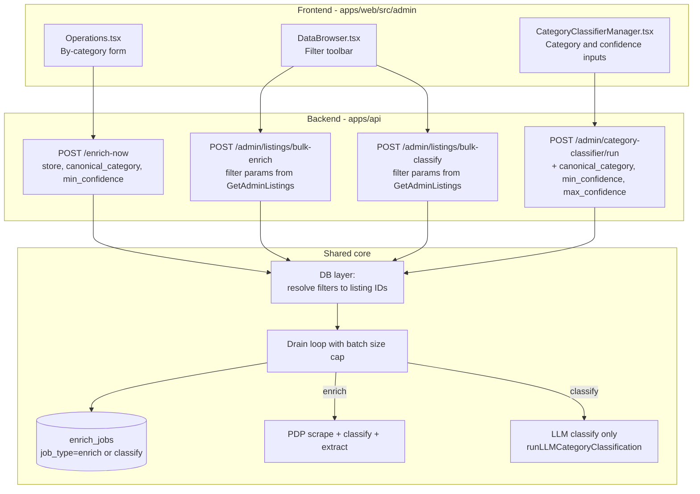

# Targeted re-enrichment controls

## Problem Statement

**HMW give operators precise, low-cost control over which deals get re-enriched, so we can fix bad categorization without burning LLM quota or waiting for global cron sweeps?**

Today's "Force re-enrich all" only drops the 7-day staleness filter and processes one batch (50). Operators identify bad data **by category** ("everything in 'mountain-bikes' is full of road bikes"), but tools only let them operate on "everything" or "one row." There's a 100x leverage move sitting between full re-enrichment and re-classification — most "bad data" is bad _categorization_, which doesn't need a PDP re-scrape.

## Recommended Direction

Build three coordinated capabilities on a unified, filter-driven backend:

1. **Re-classify-only mode (E)** — first-class, cheap operation. Re-runs only the LLM categorization step against the listing's existing `metadata` and `category_path`. Roughly 3-5x cheaper than full re-enrich; no PDP fetch, no politeness delay, no spec extraction. Backend largely exists today; surface it.

2. **Filter-driven bulk actions in DataBrowser (D)** — when DataBrowser filters are set (store, category, confidence-below, etc.), expose a toolbar with "Re-classify all matching" and "Re-enrich all matching." Reuses the filters operators already use to find bad data.

3. **By-category re-enrich in Operations (B)** — extend the Operations "Trigger enrichment" form with a canonical-category picker (and confidence threshold), since not every operator wants to navigate DataBrowser first.

All three share one backend shape: filter params → ID resolution → drain loop → job row in `enrich_jobs`. We add a `job_type` column to distinguish enrich vs classify runs so the existing job-history UI works for both.

## Architecture Sketch



---

## Phase 1: E — Re-classify-only mode (highest leverage, mostly exposure)

### Backend

**1.1.** Extend [`apps/api/internal/db/category_classifier.go`](apps/api/internal/db/category_classifier.go) — add params to `ListListingIDsForCategoryClassifierRun`:

- `minConfidence *float64`, `maxConfidence *float64` — filter on `(metadata->>'llm_confidence')::float`
- `ids []int` — explicit ID list (for future multi-select)
- `hasEnrichment *bool` — only re-classify listings that have actually been PDP-enriched (otherwise classification has nothing to work with)

**1.2.** Update `PostCategoryClassifierRun` in [`apps/api/internal/api/handlers_llm.go`](apps/api/internal/api/handlers_llm.go) to accept and pass through the new params:

```go
type body struct {
    Store              string    `json:"store"`
    CanonicalCategory  []string  `json:"canonical_category"`
    MinConfidence      *float64  `json:"min_confidence"`
    MaxConfidence      *float64  `json:"max_confidence"`
    HasEnrichment      *bool     `json:"has_enrichment"`
    IDs                []int     `json:"ids"`
    Limit              int       `json:"limit"`
}
```

**1.3.** Wrap the run in an `enrich_jobs` row so classify history is visible. Requires a small migration:

`packages/shared/migrations/011_enrich_job_type.sql`:

```sql
ALTER TABLE enrich_jobs ADD COLUMN IF NOT EXISTS job_type VARCHAR(32) NOT NULL DEFAULT 'enrich';
CREATE INDEX IF NOT EXISTS idx_enrich_jobs_job_type ON enrich_jobs(job_type, created_at DESC);
```

Reuse `CreateEnrichJob` / `FinalizeEnrichJob` paths in [`apps/api/internal/db/db.go`](apps/api/internal/db/db.go) with a new `JobType` field. The `RunEnrichmentJobForStore` pattern in [`apps/api/internal/scheduler/scheduler.go`](apps/api/internal/scheduler/scheduler.go) is the model — but for classify, the inner step is just `runLLMCategoryClassification`, no PDP call.

### Frontend

**1.4.** Update [`apps/web/src/admin/CategoryClassifierManager.tsx`](apps/web/src/admin/CategoryClassifierManager.tsx) — add inputs:

- **Canonical category** — typeahead/dropdown sourced from existing taxonomy (look at how `TaxonomyManager` lists categories).
- **Confidence below** — numeric input, default empty. (The classifier API client already accepts `canonical_category`; we need to add `min_confidence` etc. in [`apps/web/src/admin/api.ts`](apps/web/src/admin/api.ts).)
- **Estimated count** — read-only "this will affect ~N listings" preview using `GET /admin/listings?...&limit=1` to get the total count header (or a new lightweight `/count` endpoint).

**1.5.** Add a **dry-run / preview** mode — return the first 10 affected listing IDs + names so the operator can sanity-check before committing.

---

## Phase 2: D — Filter-driven bulk actions in DataBrowser

### Backend

**2.1.** New endpoints in [`apps/api/main.go`](apps/api/main.go):

- `POST /admin/listings/bulk-classify`
- `POST /admin/listings/bulk-enrich`

Both accept the **same JSON body shape as `GetAdminListingsParams`** (store_id, brand, category, canonical_category, has_enrichment, in_stock, hidden, llm_confidence_below, q). Internally:

1. Resolve to listing IDs with a new `ListAdminListingIDsByFilter` (a thin SELECT-id-only variant of `GetAdminListings`).
2. Cap to a hard safety limit (e.g. 5000 per job; configurable via env).
3. Create `enrich_jobs` row with `job_type='classify'` or `'enrich'`.
4. Drain loop — same pattern as `RunEnrichmentJobForStore`.

The endpoint **returns immediately with `{job_id}`** for runs above a threshold (e.g. 50 listings). For small runs, sync execution is fine — keeps the existing UX.

### Frontend

**2.2.** Add a bulk-action toolbar to [`apps/web/src/admin/DataBrowser.tsx`](apps/web/src/admin/DataBrowser.tsx):

- Visible whenever any filter is non-default OR the table has results.
- Two buttons: **"Re-classify all matching (N)"** and **"Re-enrich all matching (N)"**, where N is the total result count (already known from pagination metadata).
- Confirmation modal showing: filter summary, estimated count, estimated cost (`N * avg_tokens` for classify; `N * (avg_pdp_time + avg_tokens)` for enrich). Use rough heuristics from recent `enrich_jobs` to compute averages.
- "Force" toggle in the modal (mirrors today's `force=1` semantics — drops the 7-day staleness filter for re-enrich; for classify, force is implicit since classify always re-runs).

**2.3.** Show progress: poll the new `enrich_jobs` row and surface a toast/inline progress bar. Reuse the existing job-list rendering on Operations.

---

## Phase 3: B — By-category re-enrich in Operations

### Backend

**3.1.** Extend [`apps/api/internal/db/db.go`](apps/api/internal/db/db.go) `GetListingsNeedingEnrichment` to accept `canonicalCategory []string` and `minConfidence *float64`. The base query already joins `stores`; just add filters.

**3.2.** Extend the `/enrich-now` handler in [`apps/api/main.go`](apps/api/main.go) (around line 385) to read `canonical_category` and `min_confidence` query params. Pass through to the scheduler.

**3.3.** Generalize `RunEnrichmentJobForStore` → `RunEnrichmentJob(filter EnrichmentFilter)` where `EnrichmentFilter` is a struct with `Store`, `CanonicalCategory`, `MinConfidence`, `Force`. Both today's per-store and the new per-category paths become specific filter shapes.

### Frontend

**3.4.** Extend the "Trigger enrichment" panel in [`apps/web/src/admin/Operations.tsx`](apps/web/src/admin/Operations.tsx) (around lines 169-195):

- **Store** dropdown (uses `triggerEnrich`'s already-supported `store` param — currently unwired).
- **Canonical category** dropdown.
- **Confidence below** input.
- **Mode** radio: "Re-enrich (full pipeline)" vs "Re-classify only" — the latter calls `/admin/category-classifier/run` with the same filters.

This makes Operations a thin wrapper over the same backend that DataBrowser uses.

---

## Schema Changes

Single migration: `packages/shared/migrations/011_enrich_job_type.sql` — adds `job_type` column to `enrich_jobs` with default `'enrich'`. No other schema changes.

## Key Assumptions to Validate

- [ ] **Re-classify works correctly without re-scraping.** `runLLMCategoryClassification` reads from existing `metadata` and `category_path` — confirm it doesn't depend on a fresh PDP fetch by inspecting `apps/api/internal/api/handlers.go:983-1000` and tracing what it actually feeds the LLM.
- [ ] **`llm_confidence` is reliably populated.** DataBrowser already filters on `llm_confidence_below`, so it's stored — but verify what % of listings have it set. If sparse, "confidence band" filtering has limited reach until backfill.
- [ ] **Jobs at scale don't time out.** `ENRICH_JOB_TIMEOUT` defaults to 30m. A bulk classify of 5000 listings is feasible (~10ms+LLM each), but a bulk re-enrich is not. Cap bulk enrich differently from bulk classify.
- [ ] **Synchronous HTTP request is acceptable for medium-sized jobs.** Today's per-store path blocks the request for tens of minutes. For bulk operations from DataBrowser, we want immediate-return + polling. Decide threshold (e.g. > 50 listings → async).

## MVP Scope

**In:**

- Phase 1 (E) end-to-end: confidence + canonical_category in classifier UI, job tracking via `enrich_jobs`, dry-run preview.
- Phase 2 (D): bulk-classify and bulk-enrich endpoints + DataBrowser toolbar with confirmation modal and count preview.
- `enrich_jobs.job_type` migration.

**Out (defer to v2):**

- Phase 3 (B) — Operations UI extension. Once D ships, operators can do everything from DataBrowser. Phase 3 is a nice-to-have for muscle memory but not critical.
- Async job execution. Stay synchronous with safety caps; revisit if bulk runs exceed 5000 listings regularly.
- Multi-select row checkboxes in DataBrowser. Filter-driven covers 95% of cases; row-select is the long tail.
- Cost estimation modal. Show count, not cost.

## Not Doing (and Why)

- **Multi-row checkbox selection in DataBrowser** — your stated workflow is by-category, not by-row. Filter-driven bulk (D) handles that natively. Row-select adds UI complexity that pagination breaks anyway.
- **Background worker / queue infrastructure** — current scheduler.go runs synchronously in the API process; introducing Redis/SQS is out of scope. Cap job size and stay sync for now.
- **Continuous quality monitoring (variation H)** — premature. Build the manual tools first; if pain persists, we'll know what dashboards to build.
- **Fixing the underlying classifier (variation G)** — orthogonal to this plan. Track separately; better re-run controls don't preclude prompt improvements.

## Open Questions

- **Should `force` apply to classify-only?** I'd argue classify is _always_ "force" — the only reason to re-classify is to overwrite. Confirm with operators.
- **What happens to `last_enriched_at` on classify-only runs?** Recommendation: untouched. Classify isn't enrichment; conflating them muddies the staleness signal.
- **Where does the canonical-category dropdown source its options?** From `taxonomy.Map` (used by `TaxonomyManager`)? From a `DISTINCT canonical_category` query? The former is "intended categories"; the latter is "actual categories in the wild." Probably: distinct, sorted by count.
- **Confirmation threshold:** at what listing count do we require typed confirmation ("type 'reclassify' to continue")? Suggest > 1000.
