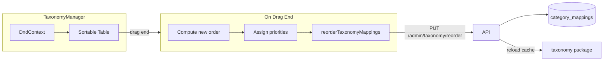

# Taxonomy Table Drag-and-Drop Reordering

## Current State

- [TaxonomyManager.tsx](apps/web/src/admin/TaxonomyManager.tsx) renders a table of category mappings sorted by `priority` (descending; higher = matched first)
- Up/down arrow buttons swap adjacent items via `handleSwapPriority` (2 parallel `PUT` requests)
- API: `PUT /admin/taxonomy/:id` updates one mapping; no batch reorder endpoint
- DB: [UpdateCategoryMapping](apps/api/internal/db/db.go) updates a single row

## Approach

### 1. Add a DnD library

Use **@dnd-kit/sortable** (with @dnd-kit/core and @dnd-kit/utilities):

- Actively maintained, widely used, works with tables
- Supports sortable lists and custom drag handles
- Accessible (keyboard, screen readers)

```bash
pnpm --filter @mtb-aggregator/web add @dnd-kit/sortable @dnd-kit/core @dnd-kit/utilities
```

### 2. Backend: Batch reorder endpoint (recommended)

Add `PUT /admin/taxonomy/reorder` that accepts:

```json
{ "updates": [{ "id": 1, "priority": 10 }, { "id": 2, "priority": 9 }, ... ] }
```

- Updates all affected rows in a single transaction
- Atomic: either all succeed or all roll back
- Reloads taxonomy cache after success (same as existing PUT handler)

**Files to change:**

- [apps/api/internal/db/db.go](apps/api/internal/db/db.go): Add `BatchUpdateCategoryMappingPriorities(ctx, []{id, priority})` using a transaction with multiple UPDATEs (or a single `UPDATE ... FROM (VALUES ...)` if preferred)
- [apps/api/internal/api/handlers.go](apps/api/internal/api/handlers.go): Add `PutAdminTaxonomyReorder` handler
- [apps/api/main.go](apps/api/main.go): Route `PUT /admin/taxonomy/reorder` (must be registered before the `:id` route so "reorder" is not parsed as an id)

**Alternative (no backend changes):** Call `updateTaxonomyMapping` for each affected item via `Promise.all`. Simpler but N round-trips and no atomicity. Acceptable for small lists (~20–50 rows).

### 3. Frontend: TaxonomyManager changes

**Structure:**

- Wrap the table body in `DndContext` and `SortableContext`
- Make each `<tr>` a sortable item via `useSortable` (or a wrapper component)
- Add a drag handle column (e.g. grip icon) so Edit/Delete remain clickable
- On `onDragEnd`: compute new order, derive new priorities, call batch reorder (or multiple updates)

**Priority computation:**

- After drop, new order is `[item0, item1, ..., itemN-1]`
- Assign `priority = N - 1 - index` so top row has highest priority (matches current semantics)

**Optimistic updates:**

- Use TanStack Query's `onMutate` to optimistically reorder the cache
- On error, `onError` + `queryClient.setQueryData` to roll back

**Files to change:**

- [apps/web/src/admin/api.ts](apps/web/src/admin/api.ts): Add `reorderTaxonomyMappings(updates: { id: number; priority: number }[])`
- [apps/web/src/admin/hooks/mutations.ts](apps/web/src/admin/hooks/mutations.ts): Add `useReorderTaxonomyMappings` with optimistic update and `adminTaxonomyKeys.all` invalidation
- [apps/web/src/admin/TaxonomyManager.tsx](apps/web/src/admin/TaxonomyManager.tsx): Integrate DnD, replace up/down arrows with drag handle, wire `handleReorder`

### 4. Table structure with DnD

DnD libraries often work better with `div`-based layouts. Two options:

- **Option A:** Keep `<table>` and use `useSortable` on `<tr>`. Some DnD libs support this; @dnd-kit can work with any DOM nodes.
- **Option B:** Replace table with a div-based layout (CSS grid or flex) that looks like a table. More reliable across DnD implementations.

Recommend **Option A** first; if layout/behavior is problematic, fall back to Option B.

### 5. UX details

- Drag handle: leftmost column with a grip icon (e.g. `⋮⋮` or similar)
- Disable drag while editing a row (`editingId !== null`)
- Show loading state during reorder (or rely on optimistic update for instant feedback)
- Remove or keep up/down arrows: optional to keep both; DnD alone is sufficient for reordering

## Data flow



## Implementation order

1. Add batch reorder endpoint (Go API + DB)
2. Add `reorderTaxonomyMappings` and `useReorderTaxonomyMappings` (api.ts, mutations.ts)
3. Install @dnd-kit packages
4. Refactor TaxonomyManager: DndContext, SortableContext, sortable rows, drag handle, `handleReorder`
5. Add optimistic updates and error rollback
6. Remove up/down arrows (or keep as secondary controls)
