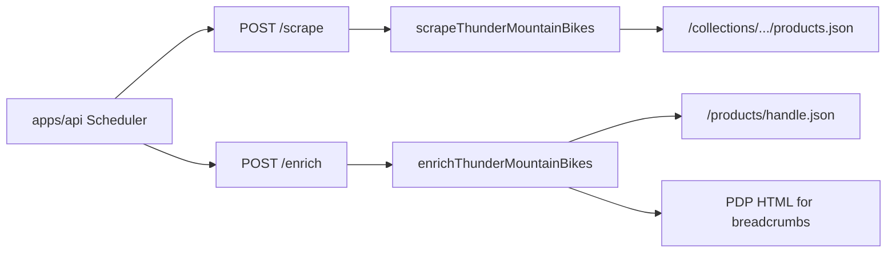

# Thunder Mountain Bikes (Shopify) integration

## Approach

Thunder Mountain (`https://thundermountainbikes.com`) will use the same mechanics as existing Shopify stores in this repo:

- **Scrape**: paginate `{collection}/products.json?limit=250&page=N` — the codebase already derives this from [`stores.scrape_url`](packages/shared/seed.sql) by stripping the path to [`/collections/{handle}`](apps/scraper/src/parsers/worldwidecyclery.ts) (query strings on `scrape_url` are ignored for the JSON URL, which is correct for Shopify).
- **Suggested seed**: `base_url` = `https://thundermountainbikes.com`, `scrape_url` = `https://thundermountainbikes.com/collections/shop-all-deals`, `store_type` = `thundermountainbikes`.
- **Enrich**: follow [worldwidecyclery.ts](apps/scraper/src/parsers/worldwidecyclery.ts): parallel `GET /products/{handle}.json` (`body_html` → specs + description) and `GET` HTML PDP (cheerio → breadcrumbs). This is broader than Revel’s `<strong>KEY:</strong> ` parser and fits unknown Shopify themes; if PDP HTML/spec layout differs materially, tighten extractors once you have real samples.

## Implementation checklist

### 1. Scraper (`apps/scraper/`)

| Item               | Detail                                                                                                                                                                                                                                                                                                                                                                                                                                                  |
| ------------------ | ------------------------------------------------------------------------------------------------------------------------------------------------------------------------------------------------------------------------------------------------------------------------------------------------------------------------------------------------------------------------------------------------------------------------------------------------------- |
| New parser         | [`apps/scraper/src/parsers/thundermountainbikes.ts`](apps/scraper/src/parsers/thundermountainbikes.ts) — copy structure from [`worldwidecyclery.ts`](apps/scraper/src/parsers/worldwidecyclery.ts): `fetchPage`, variant loop using [`buildVariantOptions`](apps/scraper/src/parsers/shopify-helpers.ts), `dedupeBySku`, `SCRAPER_MAX_PRODUCTS`, log line prefix `Thunder Mountain Bikes`. Set `BASE_URL` / console labels to thundermountainbikes.com. |
| Registration       | [`apps/scraper/src/parsers/index.ts`](apps/scraper/src/parsers/index.ts): add `PARSERS.thundermountainbikes` and `ENRICHERS.thundermountainbikes`.                                                                                                                                                                                                                                                                                                      |
| Types              | [`apps/scraper/src/types.ts`](apps/scraper/src/types.ts): append `"thundermountainbikes"` to `STORE_TYPES` (updates `ScrapeRequestSchema` / `EnrichRequestSchema`).                                                                                                                                                                                                                                                                                     |
| Stale error string | [`apps/scraper/src/server.ts`](apps/scraper/src/server.ts) line ~51: `/scrape` still prints a hardcoded store list — align with `/enrich` by using `Object.keys(PARSERS).sort().join(...)` so it stays accurate.                                                                                                                                                                                                                                        |

Optional: **`ridebicycles`-style exclusions** (e.g. gift cards) only if first scrape pulls junk from `shop-all-deals`.

### 2. API (`apps/api/`)

| Item                      | Detail                                                                                                                                                                                                     |
| ------------------------- | ---------------------------------------------------------------------------------------------------------------------------------------------------------------------------------------------------------- |
| Enrichment gate           | [`apps/api/internal/db/db.go`](apps/api/internal/db/db.go): add `"thundermountainbikes"` to `StoreTypesWithEnrichers` (nightly enrichment and admin tooling).                                              |
| Scrape whitelist          | [`apps/api/internal/scheduler/scheduler.go`](apps/api/internal/scheduler/scheduler.go) (~line 170): extend the explicit `storeType` allowlist — today unknown types wrongly fall through to `"jensonusa"`. |
| Admin create/update store | [`apps/api/internal/api/admin.go`](apps/api/internal/api/admin.go): add `"thundermountainbikes"` to `AllowedStoreTypes`.                                                                                   |
| Variant options backfill  | [`apps/api/internal/db/variant_backfill.go`](apps/api/internal/db/variant_backfill.go): extend `WHERE s.store_type IN (...)` Shopify list — same pattern as Worldwide/Revel/Ride (`thundermountainbikes`). |

No Go struct changes: [`scraper.Client`](apps/api/internal/scraper/client.go) passes `store` as a string.

### 3. Database seed

[`packages/shared/seed.sql`](packages/shared/seed.sql): `INSERT ... SELECT ... WHERE NOT EXISTS` row for Thunder Mountain Bikes with the URLs above (`affiliate_network` `NULL` like most seeds unless you specify otherwise).

Remote seed uses the same file via [`apps/api/cmd/seed/main.go`](apps/api/cmd/seed/main.go) — nothing else required.

### 4. Convenience / ops

[`Makefile`](Makefile): add `scrape-now-thundermountainbikes` and optionally `enrich-now-thundermountainbikes` mirroring [`scrape-now-ridebicycles`](Makefile) / `enrich-now-revel`.

[`apps/web/src/admin/StoreManager.tsx`](apps/web/src/admin/StoreManager.tsx): append `thundermountainbikes` to the fallback `storeTypes` array (used when API list is empty).

[`CLAUDE.md`](CLAUDE.md): add Make targets alongside other store examples.

### 5. Docs (per workspace documentation-sync rule)

- [`apps/scraper/README.md`](apps/scraper/README.md) — list `thundermountainbikes.ts` and Shopify JSON behavior.
- [`docs/SCRAPING.md`](docs/SCRAPING.md) — add store to the inventory / registration steps if listed there.
- [`apps/api/README.md`](apps/api/README.md) — mention `thundermountainbikes` in `StoreTypesWithEnrichers` / backfill Shopify list if enumerated.

### 6. Verification (after implementation)

1. `curl` / browser: confirm `https://thundermountainbikes.com/collections/shop-all-deals/products.json?limit=1&page=1` returns `{ "products": [...] }` (standard Shopify JSON).
2. Local: DB seed or admin insert → `POST /scrape-now?store=thundermountainbikes` → check listing counts / `product_group_key` / `variant_options`.
3. `POST /enrich-now?store=thundermountainbikes` (or scoped admin enrich) → confirm `category_path` and `raw_specs` populate; spot-check messy PDPs.

Optional regression test: **`thundermountainbikes.test.ts`** with mocked `fetch` — only if you want parity with [`revelbikes.test.ts`](apps/scraper/src/parsers/revelbikes.test.ts).

## Notes

- **Historical migration**: [`021_variant_grouping.sql`](packages/shared/migrations/021_variant_grouping.sql) backfilled `product_group_key` only for older Shopify types; **no new migration needed** — new listings get keys from the scraper.
- **Naming**: `thundermountainbikes` keeps `store_type` lowercase, alphanumeric, consistent with `revelbikes` / `ridebicycles`.
