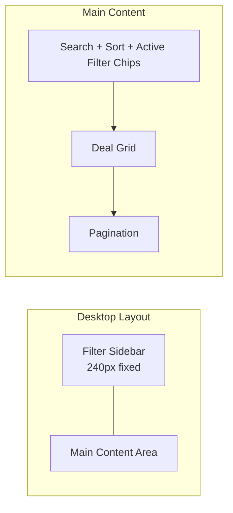

# UI Design Overhaul

## Current State

The app has a single public page (`/`) that renders `DealsPage` -- a flat layout with search, inline filters, and a deal grid. There is no home/landing page, no sidebar, and the `StatusBar` (scraper health info) is shown to end users. The filter controls (`DealFilters`) render as a horizontal flex-wrap row of dropdowns, which gets cluttered on smaller screens.

Key files:

- [apps/web/src/App.tsx](apps/web/src/App.tsx) -- routing + `DealsPage` component (all in one file)
- [apps/web/src/components/](apps/web/src/components/) -- all UI components
- [apps/web/src/hooks/useFilterParams.ts](apps/web/src/hooks/useFilterParams.ts) -- URL-backed filter state

## Page Structure

### Route Map

```
/            -> HomePage (new)
/deals       -> DealsPage (moved from /)
/admin/*     -> AdminSection (unchanged)
```

### Home Page (`/`)

A landing page with three sections:

1. **Hero** -- Brand name, short tagline (e.g. "Find the best mountain bike deals across top retailers"), prominent search bar with a CTA button that navigates to `/deals?q=...`
2. **Quick-access category cards** -- Clickable cards like "E-Bikes", "Full Suspension", "Shoes", "Helmets", etc. Each links to `/deals?canonical_category=...` with filters pre-applied. These act as the "Best deals on X" CTAs.
3. **Top deals carousel/grid** -- Fetch top N deals sorted by highest discount (reuse `fetchDeals` with `sort=discount&limit=8`). Reuse `DealCard` component. "View all deals" link at the bottom.

### Deals Page (`/deals`)

The core browsing experience, reorganized:



**Desktop (lg+):**

- Left sidebar (w-60, sticky) with all filter controls stacked vertically: Category (canonical), Store, Brand, Min Discount, Spec filters. Each section is collapsible.
- Main content area: search bar + sort dropdown in a top toolbar, active filter chips below, then the deal grid + pagination.

**Mobile (< lg):**

- Top toolbar: search bar + "Filters" button + sort dropdown
- "Filters" button opens a slide-up drawer/sheet containing the same filter controls as the sidebar
- Deal grid renders 1 column on mobile, 2 on sm

### Other Pages to Consider

- **Deal detail page (`/deals/:id`)** -- Optional future enhancement. Currently handled by `DealDetailModal` which works well for browsing flow. Could add a dedicated page later for SEO/link sharing. Not in this phase.
- No need for About, Contact, etc. at this stage. Keep it lean.

## Filter/Search/Sort Organization

### What stays at the top (always visible)

- **Search bar** -- primary interaction, always accessible
- **Sort dropdown** -- frequently toggled while browsing
- **Active filter chips** -- show what's applied with "x" to remove, "Clear all" to reset

### What moves to the sidebar / drawer

- Category (canonical) with grouped optgroups -- the primary filter
- Store
- Brand
- Min discount %
- Spec filters (contextual, shown when canonical category is selected)

### New Components Needed

| Component                | Purpose                                                                                  |
| ------------------------ | ---------------------------------------------------------------------------------------- |
| `HomePage`               | New landing page                                                                         |
| `DealsLayout`            | Sidebar + content layout for deals page                                                  |
| `FilterSidebar`          | Vertical filter panel (reuses filter logic from `DealFilters`)                           |
| `FilterDrawer`           | Mobile slide-up sheet wrapping `FilterSidebar`                                           |
| `FilterChips` (refactor) | Already exists but unused; wire up to show active filters as removable chips             |
| `Toolbar`                | Search + sort + filter-toggle row at top of deals content                                |
| `CategoryCard`           | Clickable card for home page CTAs                                                        |
| `NavHeader`              | Replace `AppHeader` with a proper nav header (logo, Home, Deals links, mobile hamburger) |

### Components to Remove

- `StatusBar` -- remove component and its usage in `App.tsx`
- `AppHeader` -- replaced by `NavHeader`

## Shared Layout and Navigation

A new `NavHeader` component replaces `AppHeader`:

- **Desktop**: Logo (left), nav links "Home" and "Deals" (center or left-aligned), clean minimal style
- **Mobile**: Logo (left), hamburger menu (right) that opens a mobile nav overlay

Both Home and Deals pages share this header. Wrap routes in a shared layout:

```tsx
<Route element={<PublicLayout />}>
  {" "}
  {/* NavHeader + children */}
  <Route index element={<HomePage />} />
  <Route path="deals" element={<DealsPage />} />
</Route>
```

## Mobile-First Responsive Approach

All components built mobile-first, then enhanced at breakpoints:

- **Base (mobile)**: Single-column layouts, full-width cards, stacked controls, drawer for filters
- **sm (640px)**: 2-column deal grid
- **lg (1024px)**: Filter sidebar appears, deal grid becomes 3 columns, drawer is hidden
- **xl (1280px)**: Deal grid 4 columns

Key patterns:

- `FilterSidebar`: `hidden lg:block` (desktop sidebar)
- `FilterDrawer` toggle button: `lg:hidden` (mobile only)
- Deal grid: `grid-cols-1 sm:grid-cols-2 lg:grid-cols-3 xl:grid-cols-4`
- NavHeader: mobile hamburger via `lg:hidden`, full nav via `hidden lg:flex`

## File Organization

Extract `DealsPage` out of `App.tsx` into its own file. New structure:

```
src/
  pages/
    HomePage.tsx
    DealsPage.tsx        (extracted + refactored)
  components/
    NavHeader.tsx        (replaces AppHeader)
    FilterSidebar.tsx    (vertical filter panel)
    FilterDrawer.tsx     (mobile sheet wrapper)
    FilterChips.tsx      (refactored to be active-filter chips)
    Toolbar.tsx          (search + sort bar)
    CategoryCard.tsx     (home page CTA cards)
    PublicLayout.tsx     (NavHeader + Outlet)
    DealCard.tsx         (existing, minor touch-ups)
    DealGrid.tsx         (existing)
    DealDetailModal.tsx  (existing)
    ...
```

## Removed: Status Bar

Delete [apps/web/src/components/StatusBar.tsx](apps/web/src/components/StatusBar.tsx). Remove the `useStatus` query and `StatusBar` rendering from `DealsPage`. Remove the export from [apps/web/src/components/index.ts](apps/web/src/components/index.ts). The status info is admin-only and doesn't belong in the consumer UI.

## No New Dependencies

Build the drawer/sheet and mobile menu with Tailwind transitions and React state. No new component library needed -- the existing Tailwind-only approach is sufficient for these patterns. If we want more polished accessible primitives later, we can add Headless UI, but it's not required for this phase.
