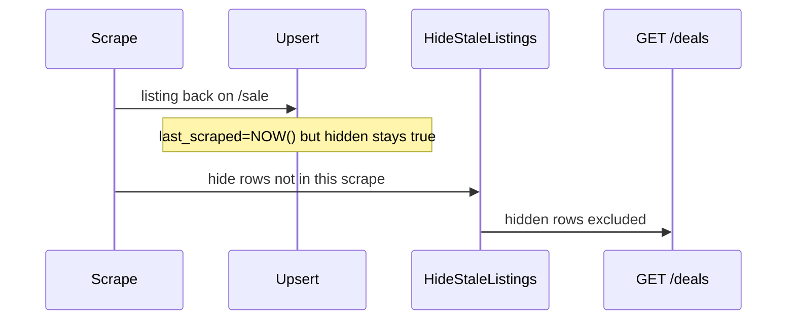

# ZAC-217: Why Öhlins TTX are hidden, and how to unhide on re-scrape

## Why these rows are hidden

They are **not** hidden by migration 025 (Jenson parent-SKU prefix hide). Every matching Jenson row is a variant SKU (`RS001105 230X65/…`), `is_in_stock = true`, and `hidden = true`.

Two mechanisms stack:

**1. Stale cleanup hid them (and everything else not in that scrape).** After a completed ingest, [`HideStaleListings`](apps/api/internal/scheduler/scheduler.go) sets `hidden = true` for any listing whose `last_scraped` predates `scrapeStartedAt`. That is working as designed for “no longer on `/sale`.”

The ticket example [Öhlins TTX Air 1](https://www.jensonusa.com/ohlins-ttx-air-1-rear-shock) (`store_sku` `RS001105 230X65/62.5/60/57.5`) was last upserted **2026-08-23**. It was **not** in the Aug 24 (1779) or Aug 25 (1513) Jenson scrapes, so it stays in the “dropped off `/sale`” bucket. Jenson sale volume itself fell from **3319** (Aug 19) to **1520** (Aug 25). `is_in_stock` is not a live PDP check — the Jenson parser always emits `is_in_stock: true` at scrape time.

**2. Scrape upsert never unhides.** [`upsertListingOnConflictSQL`](apps/api/internal/db/listings_upsert.go) updates prices, stock, and `last_scraped = NOW()`, but **does not set `hidden = false`**. Once stale-cleanup (or anything else) hides a row, later scrapes that re-find it leave it hidden.

Production evidence for (2), Jenson store_id=1, latest scrape 2026-08-25:

- Job **2188**: 1520 found, **1513 upserted**
- **45** visible vs **1468** still hidden with `last_scraped` from that same job
- All 45 visible rows were **created on or after Aug 16** (new inserts default `hidden = false`)
- Same pattern on other stores (CC 1385, UC 1170, etc.)



**Öhlins after this ticket:** they will **not** come back until they appear in a Jenson `/sale` scrape again. The chosen repair only unhides rows confirmed in the **latest** scrape (the 1468 Jenson rows, plus the same class of rows on other stores).

## Fix

### 1. Unhide on scrape upsert

In [`apps/api/internal/db/listings_upsert.go`](apps/api/internal/db/listings_upsert.go), add to the shared `ON CONFLICT` clause (used by both single-row `UpsertListing` and `UpsertListingsBatch`):

```sql
hidden = false,
last_scraped = NOW()
```

Extend [`listings_upsert_test.go`](apps/api/internal/db/listings_upsert_test.go) so the contract test requires `hidden = false`. If `TEST_DATABASE_URL` is set, assert a pre-hidden row becomes `hidden = false` after batch upsert.

**Tradeoff (accepted):** an admin “hide” on a listing still on sale will be undone by the next scrape. There is no sticky hide-reason column; `home_demoted` remains the way to keep a deal off the home rails without hiding it from `/deals`.

### 2. Re-hide superseded parents after scrape

Unhiding on upsert would revive **Universal Cycles parent product-id rows** that enrich hid via [`ApplyUniversalCyclesVariantFanout`](apps/api/internal/db/uc_pdp_variants.go) (scrape still upserts the parent every run). [`HideUniversalCyclesSupersededParents`](apps/api/internal/db/uc_pdp_variants.go) already exists and is unused.

After `HideStaleListings` in [`scheduler.go`](apps/api/internal/scheduler/scheduler.go):

- `universalcycles`: call `HideUniversalCyclesSupersededParents`
- `jensonusa`: run the same prefix-SKU hide as [migration 025](packages/shared/migrations/025_jenson_hide_superseded_parent_listings.sql) (extract a small `HideJensonSupersededParents` helper next to the UC one) so parent `dto.code` rows stay hidden when longer variant SKUs exist

### 3. One-time repair migration `040`

Unhide listings whose `last_scraped` is on/after that store’s latest **completed** scrape with `listings_upserted >= 10` (same floor as `minResultsForStaleCleanup`). Then immediately re-apply the Jenson 025 and UC 026 parent-hide predicates so repair does not duplicate grouped variants.

Idempotent; safe to re-run.

### 4. Docs

- [`apps/api/README.md`](apps/api/README.md) and [`docs/ARCHITECTURE.md`](docs/ARCHITECTURE.md): scrape upsert sets `hidden = false`; stale-cleanup still hides listings missing from the scrape; superseded Jenson/UC parents are re-hidden after scrape.
- [`packages/shared/migrations/README.md`](packages/shared/migrations/README.md): document `040`.

## Out of scope

- Pagination / `SCRAPER_MAX_PAGES` (Öhlins missing from the latest `/sale` result set)
- Sticky admin-hide reason
- Changing Jenson `is_in_stock: true` default
