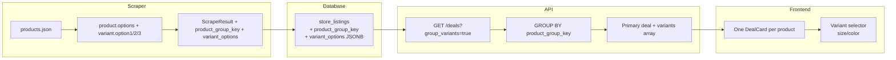

# Variant Grouping and Deduplication

## Problem

The schema was explicitly designed as a "listing-first MVP" with "deduplication deferred to later phase" (`[packages/shared/schema.sql` line 2](packages/shared/schema.sql)). That phase is now.

Shopify-based stores (3 of 5: ridebicycles, worldwidecyclery, revelbikes) emit **one `ScrapeResult` per variant**, producing multiple `store_listings` rows that share the same `product_name` and `product_url` but differ in `store_sku` and price. Users see these as "duplicate" deals cluttering results.

The Shopify products.json API already provides rich variant data we are **not capturing**: `options` on the product (e.g., `[{name: "Size", values: ["S","M","L"]}]`) and `option1`/`option2`/`option3` on each variant.

## Approach: Keep Per-Variant Rows, Group at Query Time

Rather than consolidating rows (which would lose per-variant pricing and stock tracking), we keep one row per variant and **group at API/display time**. This is less destructive, preserves granular data, and enables filtering by variant attributes.



---

## Phase 1: Database Migration

New migration `021_variant_grouping.sql` in [packages/shared/migrations/](packages/shared/migrations/):

- `product_group_key TEXT` -- groups variants of the same product (e.g., `{store_id}:{product_handle}` for Shopify; NULL for stores without variants)
- `variant_options JSONB` -- per-variant attributes, e.g., `{"Size": "Large", "Color": "Black"}`
- Index: `CREATE INDEX idx_store_listings_product_group_key ON store_listings(product_group_key) WHERE product_group_key IS NOT NULL`
- **Backfill existing data**: derive `product_group_key` from `store_id` and `product_url` for Shopify stores (all variants share the same product URL, so we can extract the handle from the path). `variant_options` will be NULL until the next scrape populates them.

```sql
-- Backfill: extract handle from product_url for Shopify stores
UPDATE store_listings sl
SET product_group_key = sl.store_id || ':' ||
  substring(sl.product_url FROM '/products/([^/?]+)')
FROM stores s
WHERE sl.store_id = s.id
  AND s.store_type IN ('ridebicycles', 'worldwidecyclery', 'revelbikes')
  AND sl.product_group_key IS NULL;
```

## Phase 2: Scraper Changes

### 2a. Extend types

In [apps/scraper/src/types.ts](apps/scraper/src/types.ts), add two optional fields to `ScrapeResultSchema`:

```typescript
product_group_key: z.string().nullable().optional(),
variant_options: z.record(z.string(), z.string()).nullable().optional(),
```

### 2b. Update Shopify interfaces

In [ridebicycles.ts](apps/scraper/src/parsers/ridebicycles.ts), [worldwidecyclery.ts](apps/scraper/src/parsers/worldwidecyclery.ts), and [revelbikes.ts](apps/scraper/src/parsers/revelbikes.ts):

- Add to `ShopifyVariant`: `title: string`, `option1: string | null`, `option2: string | null`, `option3: string | null`
- Add to `ShopifyProduct`: `options: Array<{ name: string; position: number }>`
- When building `ScrapeResult`, set:
  - `product_group_key`: `"{store_id_from_config}:{product.handle}"` -- needs a consistent scheme. Since the scraper doesn't know `store_id`, use a store-stable key like `product.handle` and let the API prepend `store_id:` during upsert. Or use `product.id` from Shopify.
  - `variant_options`: map `option1/2/3` to names from `product.options`, e.g., `{ [product.options[0].name]: variant.option1, ... }` (skipping null values)

**Key decision for `product_group_key`**: Since the scraper doesn't know the DB `store_id`, the scraper should set `product_group_key` to the Shopify product handle (e.g., `five-ten-freerider-pro-boa-flat-shoes`). The API upsert will store it as `{store_id}:{handle}` to ensure uniqueness across stores.

### 2c. Non-Shopify stores

JensonUSA and Backcountry currently emit one listing per product (not per variant), so they don't need changes. They will have `product_group_key = NULL` and `variant_options = NULL`.

## Phase 3: API Changes

### 3a. Upsert ([apps/api/internal/db/db.go](apps/api/internal/db/db.go))

- Add `ProductGroupKey *string` and `VariantOptions json.RawMessage` to the `Listing` struct
- Update `UpsertListing` INSERT/ON CONFLICT to include both new columns
- If `ProductGroupKey` is set by the scraper (just the handle), prepend `store_id:` before insert

### 3b. Grouped query mode

Add a `GroupVariants bool` field to `GetDealsParams`. When true:

- Use a CTE or window function to rank variants within each `product_group_key` (by price ASC or discount DESC)
- Select rank=1 as the "representative" deal
- Aggregate variant info: `json_agg(json_build_object('id', l.id, 'store_sku', l.store_sku, 'variant_options', l.variant_options, 'current_price', l.current_price, 'original_price', l.original_price, 'is_in_stock', l.is_in_stock))` as `variants`
- For listings with `product_group_key IS NULL`, treat each as its own group (no change)
- `total_count` should count distinct groups, not individual rows

### 3c. Variant filtering

- New query param `variant_<key>=<value>` (e.g., `variant_size=Large`)
- Filters to groups where at least one variant's `variant_options->>'Size' = 'Large'`
- Add to the `/facets` endpoint: aggregate distinct variant option keys/values from `variant_options` across visible listings

### 3d. Response shape

Extend the `Deal` struct with:

```go
Variants      json.RawMessage `json:"variants,omitempty"`
VariantCount  *int            `json:"variant_count,omitempty"`
PriceRange    *[2]float64     `json:"price_range,omitempty"`
VariantOptions json.RawMessage `json:"variant_options,omitempty"`
```

When `group_variants=false` (default for backward compat), response is unchanged.

## Phase 4: Frontend Changes

### 4a. Types and API client ([apps/web/src/api.ts](apps/web/src/api.ts))

- Extend `Deal` type with optional `variants`, `variant_count`, `price_range`
- Pass `group_variants=true` in `fetchDeals`

### 4b. DealCard ([apps/web/src/components/DealCard.tsx](apps/web/src/components/DealCard.tsx))

- When `variant_count > 1`: show a badge like "4 sizes available"
- Show price range instead of single price when variants have different prices (e.g., "$89 - $129")
- Optional: expandable variant selector (dropdown or pill group) showing available sizes/colors

### 4c. Filter sidebar

- Add variant option facets (e.g., "Size" filter with checkboxes for S/M/L/XL)
- Driven by facet data from the API

### 4d. Deal detail page

- When viewing a grouped deal, show all variants with their attributes, prices, and stock status

## Backfill Strategy

- Migration backfills `product_group_key` from existing URLs (Phase 1)
- `variant_options` will be NULL for existing rows until the next scrape cycle repopulates them
- A `make backfill-variant-options` command could optionally re-scrape product handles to populate variant_options for existing listings without waiting for the next scrape cycle

## Rollout

Default `group_variants=false` for backward compatibility. The frontend opts in by passing the param. This allows incremental rollout and easy rollback.
