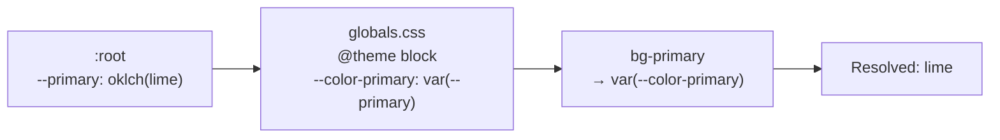

# Workshop Modern — Production Implementation Plan

Reference files:

- Design spec: [`docs/DESIGN_REDESIGN.md`](docs/DESIGN_REDESIGN.md)
- Storybook prototype: [`apps/web/src/components/WorkshopModernPreview.stories.tsx`](apps/web/src/components/WorkshopModernPreview.stories.tsx)
- Pencil layout ref: [`designs/mtb-public-ui-v3.pen`](designs/mtb-public-ui-v3.pen)

## How the Tailwind v4 token bridge works

Because `@theme` maps `--color-primary: var(--primary)` at `:root`, **updating only `:root` values in globals.css is sufficient for production** — no need to duplicate `--color-*` literals (that was only needed for the Storybook scoped-div workaround).

---

## Phase 1 — Tokens + fonts (foundational, one file)

**File:** [`apps/web/src/app/globals.css`](apps/web/src/app/globals.css)

**Font swap:**

- Remove `@fontsource-variable/plus-jakarta-sans` and `@fontsource-variable/bricolage-grotesque` imports
- Add `@fontsource-variable/geist` and `@fontsource-variable/geist-mono` (packages already installed)
- Update variables:
  - `--app-font-sans`: `"Geist Variable", ui-sans-serif, ...`
  - `--app-font-display`: `"Geist Variable", ui-sans-serif, ...` (one stack for both per spec)
  - Add `--app-font-mono: "Geist Mono Variable", ui-monospace, ...`
- Wire mono stack into `@theme`: `--font-mono: var(--app-font-mono), ui-monospace, ...`

**Token swap (`:root`):**

| Variable               | Old OKLCH       | New OKLCH target (hex ref)                               |
| ---------------------- | --------------- | -------------------------------------------------------- |
| `--background`         | warm parchment  | `oklch(0.96 0.004 240)` → `#F1F2F4`                      |
| `--foreground`         | near-black warm | `oklch(0.15 0.010 240)` → `#202327`                      |
| `--card`               | warm white      | `oklch(0.995 0.002 240)` → `#FCFCFD`                     |
| `--primary`            | burnt orange    | `oklch(0.87 0.19 118)` → `#C7E635`                       |
| `--primary-foreground` | white           | `oklch(0.15 0.010 240)` → `#202327` (ink on lime)        |
| `--muted`              | warm grey       | `oklch(0.91 0.004 240)` → `#E5E6E8`                      |
| `--muted-foreground`   | medium warm     | `oklch(0.46 0.012 240)` → `#6E7278`                      |
| `--secondary`          | stone tile      | `oklch(0.93 0.004 240)` → `#E9EAEC`                      |
| `--border`             | grey rule       | `oklch(0.83 0.008 240)` → `#D2D4D7`                      |
| `--input`              | field stroke    | `oklch(0.86 0.007 240)` → `#DADCDF`                      |
| `--ring`               | focus = lime    | same as `--primary` → `#C7E635`                          |
| `--trail`              | teal            | `oklch(0.42 0.18 22)` → deep brick/sienna (store badges) |
| `--radius`             | 0.625rem        | `0.25rem` (4px — flatter, CAD aesthetic)                 |

Keep `.dark` block as-is (deferred; plumbing preserved). The visual result will be wrong in dark mode, which is acceptable.

**After this phase:** the entire app shifts to Concrete & Lime colors + Geist font with zero component code changes.

---

## Phase 2 — Chrome: NavHeader + Button

### `NavHeader.tsx`

- Remove the theme toggle (`useTheme`, sun/moon icon button, mobile theme row)
- Update brand lockup: `THE DROPPER //` in Geist, `font-mono text-xs tracking-[0.2em]` (match Pencil nav)
- Active link: swap `border-primary` underline for a `2px solid` lime underline (it already resolves to lime after Phase 1, but confirm selector)
- Logo: can keep existing PNG for now (logo redraw is out of scope)

### `apps/web/src/components/ui/button.tsx`

Update CVA variant styles to match Workshop Modern personality:

- **`default` (Primary "Lime Switch"):** `bg-primary text-primary-foreground` with pseudo-element left stripe — implement as a `relative overflow-hidden` wrapper with an `after:` pseudo that is `4px wide, full height, bg-foreground` on the left, sliding to full-width on hover (or use a `::before` technique); active: `-translate-y-px`
- **`outline` (Secondary):** `border border-foreground text-foreground bg-transparent hover:bg-foreground hover:text-background`
- **`ghost`:** remove background; add `▸ ` prefix in label or use a CSS trick; underline on hover
- **`destructive`:** keep; update to red border variant
- All variants: `font-mono uppercase tracking-[0.12em]` on text; `rounded` at new `var(--radius)` (4px)

---

## Phase 3 — DealCard

**File:** [`apps/web/src/components/DealCard.tsx`](apps/web/src/components/DealCard.tsx)

Changes:

- **Discount badge:** `bg-primary text-primary-foreground` already wired, but add `font-mono font-bold text-xs uppercase` styling; tilt `rotate-[-2deg]` with `shadow-[2px_2px_0_#202327]` for the sticker effect
- **Brand/store line:** prefix brand with `// ` in mono (`font-mono text-[9px] tracking-widest text-muted-foreground`)
- **Price hierarchy:** ensure "SAVE $X" appears before current/was prices — reorder JSX if needed
- **"Was" price:** `line-through text-muted-foreground`
- **Store badge:** already `bg-trail/92 text-trail-foreground`; will inherit new brick-red trail color from Phase 1
- **Card hover:** `hover:-translate-y-0.5 hover:shadow-md` lift + `hover:border-foreground` thicker border; image: `group-hover:scale-[1.02] transition-transform`
- **CAD crop marks:** add to `Card` container via Tailwind pseudo-elements or an overlay `` — 8px `┼` marks at all four corners using `before:`/`after:` with `border-foreground/30`

---

## Phase 4 — SearchBar + Toolbar

### `SearchBar.tsx`

- Strip `rounded` / `border` class from the input wrapper; add `border-t border-b border-foreground` only (open-frame)
- Placeholder: add `⌕` mono glyph prefix, `text-muted-foreground`
- Focus state: bottom border → `2px` lime (`focus-within:border-b-2 focus-within:border-primary`)
- Add `⌘ K` chip in the right end of the bar (non-functional display only, or wire to focus)

### `Toolbar.tsx`

- FILTERS button: when `filterCount > 0`, use `bg-foreground text-background` fill with `text-primary` count label (`FILTERS · 3` in lime) — matches `W8I6c` in Pencil
- SORT select: `border border-foreground` at 4px radius; mono label

---

## Phase 5 — Filters: Sidebar, Chips, Checkbox

### `apps/web/src/components/ui/checkbox.tsx`

Replace Radix indicator with stamp style:

- Outer box: `w-[18px] h-[18px] rounded-none border-2 border-foreground bg-transparent`
- Checked: `bg-primary`; inner indicator: solid ink square `bg-foreground w-2 h-2 mx-auto` (no SVG checkmark)

### `FilterChips.tsx`

- Active chip: `bg-foreground text-primary font-mono text-xs tracking-wide` with `×` dismiss
- Inactive/add chip: `border border-foreground bg-transparent text-foreground`

### `FilterSidebar.tsx`

- Section headers: `// BRAND` style — `font-mono text-[9px] tracking-[0.2em] uppercase text-muted-foreground`
- Sidebar container: `border border-border rounded` at 4px; top-of-filter card matches Pencil sidebar

---

## Phase 6 — Home page

**File:** [`apps/web/src/views/HomePageContent.tsx`](apps/web/src/views/HomePageContent.tsx)

- **Hero:** Update headline to "Stop searching. Start shredding." (or keep existing if preferred — ask before changing copy)
- **Meta line:** Add `// {date} · LIVE` mono timestamp above headline (or stat ticker `47 SHOPS · 8,432 LIVE DEALS` as a subtitle)
- **Search:** Ensure `SearchBar` appears in hero at full width
- **Category cards** (`CategoryCard.tsx`): add ink panel overlay with mono category label + `//` count + lime `→`; matches Pencil "Tile forks" pattern

---

## Phase 7 — Polish pass

- **Pagination:** `PREV ‹` / `NEXT ›` in `font-mono text-xs tracking-widest`; active page: ink box
- **EmptyState / ErrorMessage:** CLI-style mono copy; empty state: dashed border; error: `border-destructive/40 text-destructive`
- **Section dividers:** `§ 01 ·` prefix + display heading + `
` rule (see `WorkshopModernPreview` SectionDivider)
- **DealCard loading skeleton:** lime-dot pulsing `// LOADING` header (or keep default skeleton; note in scope)
- **PostHog check:** search, filter, and deal_card_click events already instrumented — confirm event names are unaffected by markup changes; no new events required

---

## What's explicitly out of scope

- Dark mode UI (toggle removed; `.dark` CSS block preserved)
- Logo redesign
- Mobile-specific layout changes beyond what falls naturally from component updates
- Admin section styling
- Real product photography

---

## Recommended commit order

1. `feat: swap Workshop Modern tokens + Geist fonts in globals.css`
2. `feat: update NavHeader – remove theme toggle, mono brand lockup`
3. `feat: update Button – lime-stripe primary, mono labels, 4px radius`
4. `feat: update DealCard – Workshop Modern badge, brand prefix, hover lift`
5. `feat: update SearchBar + Toolbar – open-frame search, active filter pill`
6. `feat: update filters – stamp checkbox, ink chips, mono sidebar headers`
7. `feat: update home page shell – hero, category tiles`
8. `chore: polish pass – pagination, empty states, section dividers`
