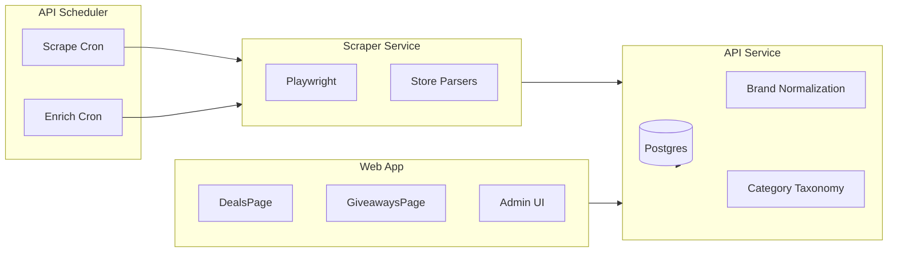

# Architecture

Overview of the MTB aggregator data flow, services, and design decisions.

## System Overview

## Services

| Service   | Stack                                             | Port | Role                                      |
| --------- | ------------------------------------------------- | ---- | ----------------------------------------- |
| API       | Go (net/http, pgx)                                | 8080 | REST API, scheduler, orchestration        |
| Scraper   | Node.js + Express + Playwright                    | 3000 | Scrapes retailer sale pages               |
| Web       | Next.js 15 + React + Tailwind v4 + TanStack Query | 3000 | Public deals UI (SSR/ISR), admin          |
| Storybook | Storybook 8 + Vite                                | 6006 | Component development, design system docs |

## Data Flow

### 1. Scrape Job (every 4h)

1. Scheduler triggers `POST /scrape-now` (or per-store via `?store=xxx`)
2. API iterates stores. **Competitive Cyclist** (`store_type=competitivecyclist`) is ingested inside the API via the **Impact Partner Product Catalog** (HTTP Basic: `IMPACT_ACCOUNT_SID` / `IMPACT_AUTH_TOKEN`) — no Playwright call. All **other** stores call the scraper `POST /scrape` with `url` + `store_type`.
3. Scraper runs the store parser (Playwright or fetch), returns `ScrapeResult[]` (skipped for CC). Shared field / pagination / variant / error contract: [docs/specs/scrape-contract-zac-255.md](specs/scrape-contract-zac-255.md). SKU / `product_group_key` / option-key identity: [docs/specs/variant-identity-zac-254.md](specs/variant-identity-zac-254.md). PDP / LLM classify / extract after ingest: [docs/specs/enrichment-normalization-zac-253.md](specs/enrichment-normalization-zac-253.md).
4. API **batch-upserts** listings into `store_listings` (UNNEST chunks of 500, same merge semantics as single-row upsert; nested `category_path` / `canonical_category` are bound as `jsonb[]` then converted to `text[]`), applies brand normalization, extracts metadata, and sets **`affiliate_url`** for **Competitive Cyclist** via `IMPACT_DEEP_LINK_COMPETITIVE_CYCLIST` when configured, otherwise from the Impact catalog **`Url`** when it carries redirect attribution (plain PDP URLs omit **`affiliate_url`**). Public reads prefer **`affiliate_url`** over **`product_url`** for “View deal” CTAs when the column is populated. On conflict, scrape upsert sets **`hidden = false`** so a listing that returns on `/sale` is visible again (ZAC-217). **Today** scrape also overwrites **`is_in_stock`** on every upsert (no-signal PLPs such as Jenson always send `true`, which can resurrect OOS SKUs on `/deals` and re-queue PDP). **ZAC-256** ([policy](ideas/oos-policy-zac-256.md)) will overwrite stock only when scrape `stock_from_plp` is true. After a completed ingest, **`HideStaleListings`** hides rows whose `last_scraped` predates the run, unless the scrape was truncated **or** thin vs the store’s 14-day max upserted count (ZAC-270); **JensonUSA** and **Universal Cycles** then re-hide superseded parent SKUs (same predicates as migrations `025` / `026`) so variant fan-out is not duplicated. Migration **`055`** one-shot-unhides rows confirmed by each store’s latest **full** scrape (at least half of that store’s 14-day max `listings_upserted`), then re-applies those parent hides.

**Scrape job timeouts:** Fetch (HTTP scrape / Impact catalog) and ingest (DB upsert) use separate budgets (`SCRAPE_JOB_TIMEOUT`, default 20m; `SCRAPE_INGEST_TIMEOUT`, default 15m). **JensonUSA** fetch is floored at 45m so a 50-page `/sale` scrape can finish. Terminal job status is persisted via a detached DB context so timeouts still land as `timed_out` with partial counts. Stale-listing cleanup runs only when ingest completes fully **and** the scrape was not truncated by a page cap (`X-Scrape-Truncated`) **and** was not thin vs the store’s recent full scrape (ZAC-270).

**Shopify variants:** For Shopify-based stores, each variant is a row (`store_sku` unique per store). `product_group_key` is `{store_id}:{product_handle}` for grouping; `variant_options` holds option dimensions (e.g. `Size`, `Color`) from the products JSON API. `GET /deals?group_variants=true` returns one representative deal per group with `variants[]`, `variant_count`, and optional `price_range`. The web UI ([`VariantChips`](../apps/web/src/components/VariantChips.tsx)) shows **in-stock** size/color chips on listing cards (size preferred; Size may be inferred from a Jenson-style SKU suffix); sold-out options are omitted (not struck). Shopify dummy options (`Title` / `Default Title`) and Jenson schema.org leftovers (`Schema Stock Status`) are omitted on scrape, stripped again on ingest/upsert merge (so an empty incoming scrape cannot keep stored junk), and filtered before chips or PDP option badges render (ZAC-278, ZAC-281). Migration **`061`** one-shot-cleans existing rows. The deal PDP lists those variants in a table with an **In stock** badge on each row (no chips), including when only one in-stock variant remains. Card/PDP **price range** is computed from in-stock variants only so a sold-out SKU cannot widen the range. Groups without parseable `variant_options` keep the existing `N variants` badge. Backfill `make backfill-variant-options` (API) primarily paginates each store’s **`stores.scrape_url`** collection **`/products.json`** (same as scrapers), then optionally falls back to **`/products/{handle}.json`** for handles not in that index; see [apps/api/README.md](../apps/api/README.md).

**JensonUSA variants:** Clearance listing cards hydrate `data-product-result-dto` with a `variants` array. The scraper emits one row per variant (`store_sku` = `variant.code`, `product_group_key` = parent `code`) with listing-time `variant_options` (often Color-only vs the PDP). Schema.org DTO fields such as `schemaStockStatus` are not treated as facets. When Size is missing, it is inferred from the variant code suffix (`BI005147 RED/BLACK XL` → XL). Scrape upsert **merges** `variant_options` so that Color-only PLP payload cannot wipe Size from PDP enrich (ZAC-276). Enrichment calls the scraper’s Jenson PDP parser, which reads `serverSideViewModel.variants` from the HTML and returns structured dimensions plus `is_orderable`; the API applies that to **every** listing row with the same `product_group_key` (deduped: one PDP fetch per parent per batch). Listing prices are not overwritten from the PDP. Migration **`025_jenson_hide_superseded_parent_listings`** hides legacy parent-only rows that share a `product_url` with longer variant SKUs so the deals list does not duplicate products.

**Deals list sorting:** Default when `sort` is omitted is `discount` (highest % off). `GET /deals` also supports `sort=value` (largest savings: `original_price - current_price`), `newest`, `price_asc`/`price_desc`, and `relevance` (with `q`). Filters include `min_price`, **`max_price`**, and `exclude_category_slug` (subtree) for surfacing higher-ticket items on the home page without manual curation; **`max_price`** also powers buyer-intent **SEO hub** pages on the web (`/deals/hub/...`).

**Brand facets:** `GET /facets` `brand_facets` are scoped to the same filters as other facets except all `brand` query params are omitted when aggregating brands (so the deals UI can list alternative brands while one or more are selected). Brand labels come from `store_listings.brand` after scrape-time `internal/brand` normalization (`packages/shared/brand_aliases.json`; case-insensitive, suffix stripping for Bicycles/Cycles/Inc). The API Docker image copies that JSON (`BRAND_ALIASES_PATH`). Re-apply to existing rows with `make backfill-brands` or `POST /admin/renormalize-brands`.

**Spec facets:** Each `spec_*` facet’s value list is aggregated without applying that key’s own `spec_*` filter (faceted-navigation pattern, same as brands). Repeated `spec_*` values OR within the key.

**Facet listing visibility:** `GET /facets` includes only in-stock listings with `hidden = false`, same as public `GET /deals`, so facet counts cannot reference rows that deals queries exclude.

**Giveaways & raffles (editorial):** Manually curated rows in `giveaways` (migration `049`). Public `GET /giveaways` returns published contests whose `ends_at` is within the last 30 days (optional `?kind=giveaway|raffle`; hard cap 100). **`status` is derived from timestamps at read time** (`open` / `upcoming` / `ended`) — it is not stored. Admin CRUD is Bearer-auth at `/admin/giveaways`. The web list at `/giveaways` uses **60s ISR** (exception to the 4h listing cadence); Home shows an **Open entries** strip **below the deal carousels** only when at least one row is still **open**. The UI re-derives status from `starts_at` / `ends_at` so stale HTML cannot keep an Enter CTA after close. After admin save, Next.js revalidates `/giveaways`, `/`, and the `giveaways` fetch cache tag.

### 2. Enrichment: PDP drainer + LLM passes (async / hourly)

Shared contract (inputs, skip, idempotency, store capability matrix, new-store “enrich done”): [docs/specs/enrichment-normalization-zac-253.md](specs/enrichment-normalization-zac-253.md).

**PDP (resident drainer + optional burst):**

1. On API start, a **resident PDP drainer** goroutine round-robins enricher stores, claiming **one due listing per store** at a polite pace (`ENRICH_PDP_MIN_INTERVAL`, default 15s). Pacing and circuit-breaker cooldown persist on `stores` (`pdp_last_fetch_at`, `pdp_cooldown_until`; migration `043`). **`pdp_last_fetch_at` is stamped when the scraper call starts**, not when a blank `listing_enrichment` row is ensured — stamping earlier makes the min-interval check skip the fetch (ZAC-247). No `enrich_jobs` row is created for drainer work.
2. **`POST /enrich-now`** (async; returns 202) runs a **burst** PDP job (`job_type=enrich`) that bypasses min-interval pacing but still skips stores in cooldown unless `force=1`. Optional legacy nightly cron via **`ENRICH_CRON_SPEC`** (default **`disabled`**) uses the same burst path.
3. PDP claims use `listing_enrichment` (`FOR UPDATE SKIP LOCKED` + per-step `*_leased_until`). Snapshots land in `pdp_snapshots`; failures record backoff in `enrichment_events`. Only **in-stock, non-hidden** rows are eligible. Stale horizon defaults to **30 days** (`ENRICH_PDP_STALE_AFTER`). **ZAC-256** ([policy](ideas/oos-policy-zac-256.md)) adds a separate **OOS stock-check** claim for no-signal stores still on /sale (`ENRICH_OOS_STOCK_CHECK_AFTER`, default 24h): stock/fan-out only; skip LLM if still OOS.
4. After each **successful drainer PDP**, the scheduler kicks a debounced async **`llm_specs` job** for that store (skips if one is already in flight). Burst PDP jobs kick LLM once when the job finalizes.

**LLM classify + extract (scrape / PDP / hourly):**

- After each **successful store scrape** (enricher stores only): async `llm_specs` job scoped to that store (`triggered_by=scrape`).
- After **drainer PDP success** (debounced per store) or **burst PDP job** completion: async `llm_specs` with the same filter (`triggered_by=pdp`).
- **Hourly safety net** (`LLM_CRON_SPEC`, default `0 * * * *`): global `llm_specs` job catches prompt-profile bumps and anything missed (`triggered_by=cron`). Startup catch-up uses **`LastLLMSpecsJobAge`** only (no PDP catch-up burst).
- LLM jobs use `ClaimForStep` for classify/extract only (require existing PDP snapshot); **brand-new post-scrape listings still wait for PDP** before LLM eligibility.

4. For each store with an enricher in `StoreTypesWithEnrichers` (excludes **Competitive Cyclist** — CC ingest is Impact catalog only; scheduled PDP enrich is skipped because WAF blocks automated scraper access): Scraper visits PDP URLs. CC variant fan-out (`internal/db/cc_pdp_variants.go`) still applies when CC listings are enriched via admin/manual paths or backfill.
5. Parsers extract retailer category hints (e.g. breadcrumbs or Shopify `product_type`) and specs (tables, definition lists, or—for **Revel Bikes**—`<strong>KEY:</strong> value` paragraphs in `body_html` from `/products/{handle}.json`)
6. API merges PDP specs into `metadata`, then maps `category_path` through `taxonomy.Map` (most specific breadcrumb segment first) and **`taxonomy.RefineListing`** (`RefineWheelsTires` title: wheelset/rim vs Tires, ZAC-263; `RefineBrakes` title: cables/olives/adapters vs Brakesets, ZAC-272; `RefineApparel` title: garments vs Bikes, ZAC-264; `RefineElectric` title: analog MTBs / parts vs Electric, ZAC-273) to set `canonical_category` and `category_id` **unless** the listing already has a confident `metadata.llm_category` (same threshold as the classifier, overridable via `LLM_CATEGORY_PRESERVE_THRESHOLD`) — in that case only `category_path` and `metadata` refresh so a failed LLM step cannot revert a good prior classification.
7. Optional **LLM category classifier** refines `canonical_category` / `category_id` when enabled (`RefineListing` runs on the LLM path so a Tires enum pick cannot stick when the title is a wheelset or rim, brake hardware cannot stick on Brakesets, apparel cannot stick on Bikes, and analog MTBs / parts cannot stick on Electric); then optional **LLM spec extraction** runs per `llm_prompt_profiles`.

**LLM specs without PDP (ID-list / admin):** For profile iteration or backlog fixes without re-scraping PDPs, operators can trigger classify + extract **against existing row data only** via `POST /llm-specs-now` (filters → listing IDs; unchanged from scheduler `ClaimForStep` jobs). Admin also exposes **`POST /admin/listings/bulk-llm-specs`** and **`POST /admin/listings/:id/llm-specs`**.

**Admin Insights (pipeline observability):** [`GET /admin/metrics/pipeline`](apps/api/README.md) and [`GET /admin/metrics/enrichment-steps`](apps/api/README.md) report flow-centric health — scrape→extract latency, per-step due/in-flight/dead gauges, daily `enrichment_events` throughput, PDP freshness, and per-store drainer cooldown — not nightly `enrich_jobs` windows (the drainer has no job boundary). Burst/LLM job history remains on the Operations page.

**LLM extraction profiles:** For each category, `llm_prompt_profiles` drives structured spec extraction. When migration `019` composition rows exist (`llm_prompt_profile_fields`), the API **hydrates** `extraction_schema` at read time from `llm_extraction_field_defs` plus per-profile overrides (and appends `confidence` when not composed). If there are no composition rows, the stored `extraction_schema` JSONB is used unchanged. Field defs may set **`extractable = false`** (migration `041`) to keep a field in facets/schema while omitting it from the LLM JSON schema — e.g. **`clothing_size`** is copied from `variant_options.Size` on scrape ingest, variant fanout, and after LLM extract, and leftover size charts are split into a `multi_enum` array so Size facets are individual values (ZAC-248; `make backfill-clothing-size` after migration `060`). **`bike_size`** (migrations `050`/`051`) is a scalar extractable enum on the Bikes parent profile (inherited by Road/Gravel/BMX and the rest) so complete-bike listings get a Size facet — letters, Specialized S-sizing, MTB inches, road/gravel cm, or BMX top-tube. It is not `multi_enum`: live in-stock size sets stay on variant chips. Scrape ingest and `make backfill-bike-size` also copy normalized variant Size into `llm_specs.bike_size`. Listing cards fall back to that extracted size when a group has no parseable `variant_options` sizes. Helmets **`coverage`** (ZAC-277 / migration `061`) is rewritten after extract by `metadata.InferHelmetCoverage` (ear coverage + chin bar; Fox Dropframe / Giro Tyrant / iXS Trigger X stay 3/4; MTB/MIPS alone does not imply Full face); `GET /deals` and `/facets` match `llm_overrides || llm_specs`. Run **`make backfill-helmet-coverage`** after `061`.

**Inheritance (category tree):** On hot paths `GetLLMPromptProfileForCategory` and `GetLLMPromptProfileForCategoryID`, the API builds an **effective** extraction schema by merging **enabled** profiles along the path from the **category root to the leaf** (in order). A field `key` defined on a **deeper** category **replaces** the same key from an ancestor (child wins). `system_prompt`, profile `name`, and admin-facing identity use the **nearest enabled** profile to the leaf (most specific). A single `confidence` field is appended after the merge (same source as composition hydration). `GetLLMPromptProfileByID` still loads one stored profile (for editing); `GET /admin/llm-profiles/:id` includes **`effective_extraction_schema`** when `category_id` is set so operators can preview the merged schema. Listings that match a legacy profile row only via `canonical_category` text (no resolved `category_id`) use that row without ancestor merge.

Hot paths (`GetLLMPromptProfileForCategory*`, `GetLLMPromptProfileByID`) hydrate per-profile JSON when composition rows exist; `ListLLMPromptProfiles` keeps raw JSON for the admin table.

**Admin field library:** `GET/POST /admin/llm-extraction-field-defs` and `GET/PUT/DELETE /admin/llm-extraction-field-defs/:id` CRUD the global defs. `GET /admin/llm-profiles/:id` includes `profile_fields` when composition exists, and **`effective_extraction_schema`** when `category_id` is set (merged ancestor + node schema for runtime). `PUT /admin/llm-profiles/:id` accepts optional `profile_fields` to replace composition; clients must not send `extraction_schema` when also sending `profile_fields`, or when the profile already has composition rows (update meta only, or change schema via `profile_fields`). The web admin **LLM Profiles** page (`/admin/llm-profiles`) exposes a **Field library** tab plus a composition editor for profiles with rows; profiles still on raw JSON can switch to composition or clear composition to return to JSON editing.

### 3. Category Taxonomy

- **Structured tree**: `categories` table (id, slug, name, parent_id, optional `description` for LLM rubrics — migration `023`, `hide_from_nav` — migration `053`) — single source of truth. Hidden-from-nav categories stay on `/categories` and in classification; the header mega-menu omits them. Helmet parts and Components `{Parent} parts` (ZAC-271) are hidden from nav by default.
- **Listings**: `store_listings.category_id` FK ties each listing to the structured tree and drives public filtering (`GET /deals?category_slug=` uses subtree IDs). `canonical_category` (`text[]`) is a denormalized taxonomy path that usually mirrors that FK but can drift when enrichment/classifier/scrape paths disagree or when `UpsertListing` preserves an older `category_id`. The admin Data Browser supports **`category_slug`** (matches `/deals`) and **`canonical_category`** (exact array match) so drift is visible.
- **Mappings**: `category_mappings` map raw store paths (e.g. `["Components", "Brakes"]`) to `category_id`
- **LLM classifier**: Optional LLM-based classification; valid outputs are paths from the live tree; non-empty per-category `description` values are appended to the classifier user prompt as “Category definitions” (distinct from public SEO copy in the web app)

## Key Directories

| Path                            | Purpose                                                                        |
| ------------------------------- | ------------------------------------------------------------------------------ |
| `apps/api/internal/scheduler/`  | Cron jobs, scrape/enrich orchestration                                         |
| `apps/api/internal/enrichstate/` | Durable per-step enrichment pipeline (state, snapshots, events)             |
| `apps/api/internal/llmlisting/` | LLM classify + spec extraction pipeline shared by enrichment and LLM-only jobs |
| `apps/api/internal/db/`         | All pgx queries                                                                |
| `apps/api/internal/brand/`      | Brand aliases normalization                                                    |
| `apps/api/internal/taxonomy/`   | Category mapping, in-memory cache                                              |
| `apps/api/internal/metadata/`   | Spec extraction from enriched data                                             |
| `apps/scraper/src/parsers/`     | One parser per store                                                           |
| `apps/web/src/components/ui/`   | shadcn primitives (Button, Input, Card, Drawer/Vaul, etc.)                     |
| `apps/web/src/components/`      | Composed components (DealCard, DealCarousel, ViewAllDealsCard, VariantChips, CategoryCard, Pagination, etc.)   |
| `apps/web/.storybook/`          | Storybook config, preview decorators                                           |

## Component Library

The web app uses a design system built on **shadcn/ui** and **Tailwind v4** for visual consistency. See [docs/DESIGN.md](DESIGN.md) for visual identity, copy guidelines, and the "dialed-in" vibe.

### Primitives (`src/components/ui/`)

- **Button** — Primary, outline, secondary, ghost, destructive, link variants
- **Input** — Text, search, number, password
- **Card** — CardHeader, CardTitle, CardDescription, CardContent, CardFooter

Add new primitives via `pnpm dlx shadcn@latest add <component>` in `apps/web`.

### Theming

- **CSS variables** in `src/app/globals.css` (`:root`, `.dark`) — `--app-font-sans`, `--app-font-display`, `--primary`, `--background`, etc. (`@fontsource-variable/plus-jakarta-sans`, `@fontsource-variable/bricolage-grotesque`).
- **Tailwind @theme** — Maps variables to utilities (`bg-primary`, `text-muted-foreground`)
- **Dark mode** — Class-based (`dark` on ancestor); toggle in Storybook toolbar

### Storybook

- **Run**: `pnpm --filter @mtb-aggregator/web run storybook` (port 6006)
- **Build**: `pnpm --filter @mtb-aggregator/web run build-storybook`
- **Stories**: `*.stories.tsx` next to components; use CSF3 format
- **Theme toolbar**: Light/dark toggle for palette iteration
- **Design tokens**: See **Design / Design Tokens** for the palette (Carbon Grey, Mud/Deep Forest, Hazard Orange) and typography. [docs/DESIGN.md](DESIGN.md)

### Composed Components

High-level components (DealCard, DealCarousel, ViewAllDealsCard, VariantChips, CategoryCard, Pagination, SearchBar, FilterSelect) use the primitives. Deal cards stretch in grids and homepage rails so price + CTAs stay aligned; overflowing rails keep a peek of the next card and reserve left/right gutters (tighter on small screens) for prev/next arrows. Each homepage rail ends with a View all card linking to the matching deals list. When adding or changing UI, prefer primitives over raw HTML and add Storybook stories.

### SEO (metadata)

Growth and channel priorities (SEO vs community vs email) live in **[docs/MARKETING.md](MARKETING.md)**. This section is the technical baseline those channels assume.

The web app sets `metadataBase`, default Open Graph/Twitter fields (including a default OG image via `the-dropper-logo-horizontal.png`), and `robots` in [`apps/web/src/app/layout.tsx`](apps/web/src/app/layout.tsx). [`apps/web/src/lib/siteUrl.ts`](apps/web/src/lib/siteUrl.ts) resolves the public origin from `NEXT_PUBLIC_SITE_URL`. On **Vercel Production**, `NEXT_PUBLIC_SITE_URL` is required — the app throws at runtime if it is missing (falling back to `VERCEL_URL` would use the deployment hostname and break canonicals and sitemap URLs). **Vercel Preview** uses `VERCEL_URL` when unset. Local dev defaults to `http://localhost:3000`. Home, `/deals`, and `/categories` export static `metadata`; **`/giveaways`** uses a 60s `revalidate` with title **Giveaways & raffles**; **`/links`** is the Instagram link-in-bio page (`noindex, follow`, not in the sitemap — [SOCIAL.md](SOCIAL.md)); deal detail, `/deals/c/[...slug]`, and **`/deals/hub/[slug]`** use `generateMetadata` with canonical URLs (hubs use `noindex` when inventory is below the curated threshold). **Deal detail** (`/deals/{id}`) is explicitly `index, follow` with a query-free canonical to `/deals/{id}` ([`dealPageMetadata.ts`](../apps/web/src/lib/dealPageMetadata.ts)); missing listings noindex. **`/deals/{id}/price-history`** is always `noindex`. Deal detail uses `openGraph.type: "article"` and prefers the listing `image_url` for OG/Twitter, falling back to the site wordmark when absent.

**JSON-LD** — [`apps/web/src/components/JsonLd.tsx`](apps/web/src/components/JsonLd.tsx) + [`apps/web/src/lib/jsonLd.ts`](apps/web/src/lib/jsonLd.ts): home emits `WebSite` + `SearchAction` (deals search) with **`sameAs`** pointing at [Instagram @thedropper.shop](https://www.instagram.com/thedropper.shop/), and an `ItemList` for featured deals; `/deals` emits `BreadcrumbList` + `ItemList` (same cap as category lists); **`/deals/hub/[slug]`** emits `BreadcrumbList` + `ItemList` + optional **`FAQPage`** when a hub defines FAQ items; `/categories` emits a `CollectionPage` hub with `hasPart` linking to each top-level department’s `/deals/c/...` URL; **`/giveaways`** emits `CollectionPage` + `ItemList` of names/`#slug` URLs only (no `Event` / `Offer`); deal detail emits `BreadcrumbList`, `Product` + `Offer`; category deal routes emit `BreadcrumbList` + `ItemList` (first 12 URLs, `numberOfItems` = total matching).

**GEO / AI discovery** — Static [`apps/web/public/llms.txt`](apps/web/public/llms.txt) and [`apps/web/public/llms-full.txt`](apps/web/public/llms-full.txt) summarize the site for crawlers and assistants.

**Sitemap / robots** — [`apps/web/src/app/sitemap.ts`](apps/web/src/app/sitemap.ts) and [`apps/web/src/app/robots.ts`](apps/web/src/app/robots.ts). Sitemap includes static routes (including `/categories` and **`/giveaways`**, daily, priority 0.7), category paths from `GET /categories/tree` **only for nodes with shopper-facing deals** (`product_count`, falling back to `deal_count` — same rule as homepage tiles and the mega-menu), **curated `/deals/hub/...` URLs** when live inventory meets a minimum threshold (same rule as `robots` indexing for those pages), **brand pages** when grouped deal count ≥ 3 (same rule as brand `robots`), and deal detail URLs from **`GET /sitemap-listings`** (in-stock, not hidden, one ID per product group — not expired/hidden “Deal not found” rows). Locs are apex-only (no `www`, no query params). **`/deals/{id}/price-history` is never listed** (noindex by design). Empty category routes get `noindex` via metadata. **Middleware** [`apps/web/src/middleware.ts`](apps/web/src/middleware.ts): `308` from `/deals?category=` to `/deals/c/...` for canonical category URLs, and `308` from `/deals/{id}?from=` to `/deals/{id}`. Matcher is `/deals` and `/deals/:path*` only — static files such as the IndexNow key at `/{key}.txt` are not rewritten.

**IndexNow** — Public ownership key [`apps/web/public/5130963c54f0f6fab8dede8ea6f6e38c.txt`](../apps/web/public/5130963c54f0f6fab8dede8ea6f6e38c.txt) is served at `https://thedropper.shop/5130963c54f0f6fab8dede8ea6f6e38c.txt`. [`apps/web/src/lib/indexNow.ts`](../apps/web/src/lib/indexNow.ts) POSTs to `https://api.indexnow.org/indexnow` only when `VERCEL_ENV=production` (preview/staging/local never submit; `INDEXNOW_SUBMIT=0` disables). Triggers: Vercel Cron `GET /cron/indexnow` daily 07:15 UTC ([`apps/web/vercel.json`](../apps/web/vercel.json); auth `CRON_SECRET` Bearer or `X-Cron-Secret` or admin Bearer), optional `POST` with `{ "urls": [...] }`, and admin cache revalidate (`after()`). `robots.txt` disallows `/cron/`. After merge, connect the key in Bing Webmaster IndexNow.

**Category intros & deal breadcrumbs** — Category routes pass `getCategorySeo().intro` into [`DealsPageContent`](apps/web/src/views/DealsPageContent.tsx). **SEO hubs** may add optional FAQ copy, parent-category links, and sibling hub links ([`docs/ideas/price-band-hub-indexing.md`](ideas/price-band-hub-indexing.md)); Popular searches and category/hub intros render **below the deal grid** so listings stay above the fold; the home page links eligible hubs for crawl discovery. Price-band hubs include `/deals/hub/mountain-bikes-under-3000` and `/deals/hub/emtbs-under-5000` (`bikes-emtb`, `max_price=5000`). Deal detail uses [`categorySlugFromCanonicalPath`](apps/web/src/lib/categoryTree.ts) and [`categoryPathLabelFromSlug`](apps/web/src/lib/categoryTree.ts) to link to `/deals/c/...` when `canonical_category` matches the tree.

## Analytics

The web app uses [Vercel Web Analytics](https://vercel.com/docs/analytics) via `@vercel/analytics`. Enable Web Analytics in the Vercel project dashboard (Analytics → Enable) after deploying. Page views and visitors are tracked automatically. Hobby does not record custom events; **PostHog** is the source of truth for `deal_outbound_click` and other product events.

Weekly unique visitors, outbound clicks, and referring domains: pinned **[Weekly marketing readout](https://us.posthog.com/project/355496/dashboard/2066236)** (checklist + baseline in [docs/MARKETING.md](MARKETING.md#weekly-readout-zac-259)). Product-behavior tiles: [Analytics basics](https://us.posthog.com/project/355496/dashboard/1395138).

**Custom events** (require Vercel Pro or an alternative such as PostHog) are wired via `track()` and/or `posthog.capture()` in [DealCard](apps/web/src/components/DealCard.tsx), [DealDetailModal](apps/web/src/components/DealDetailModal.tsx), [DealFilters](apps/web/src/components/DealFilters.tsx), [SearchBar](apps/web/src/components/SearchBar.tsx), [DealsPageContent](apps/web/src/views/DealsPageContent.tsx), and related components:

- `deal_card_click` — user opens deal detail (`deal_id`, `store`, `brand`, `list_surface`, `in_stock_size_count`, `in_stock_color_count`)
- `home_rail_scrolled` — homepage carousel arrow (`direction`: `prev` | `next`, `nav_source: "arrow"`, optional `home_section`)
- `home_view_all_clicked` — homepage “View all” CTA (`nav_source`: `section_header` | `rail_end_card`, `href`, optional `home_section`)
- `deal_detail_viewed` — deal PDP mount (same identity fields plus `in_stock_variant_count`)
- `deal_outbound_click` — user clicks through to retailer (`cta`, `deal_id`, `store`, `brand`, `list_surface`). Prefer this over retired `view_deal` / `view_at_store`.
- `filter_applied` — store, brand, category, sort, min_discount, spec, or **giveaway kind chips** (`filter_type: "giveaway_kind"`, `value`: `all` | `giveaway` | `raffle`)
- `giveaway_page_viewed` — `/giveaways` list mount
- `giveaway_outbound_click` — primary enter/ticket CTA (`giveaway_id`, `kind`, `status`, `host_name`, `surface`: `home` | `giveaways`)
- `link_in_bio_viewed` — `/links` mount (Instagram bio landing)
- `link_in_bio_clicked` — destination tap on `/links` (`link_id`, `href`)
- `search` — search query (debounced)
- `deals_transition_timeout` — deals filter/sort/pagination navigation exceeded the client pending timeout (~15s); includes `duration_ms`, `pathname`, `search_params`, `sort`, `offset`

See [.cursor/plans/website_analytics_plan_f835d1a0.plan.md](../.cursor/plans/website_analytics_plan_f835d1a0.plan.md) for details and alternatives.

## CI security checks

GitHub Actions (`.github/workflows/ci.yml`) runs on every push and PR to `main`. Checks are **parallel jobs** (`secrets`, `web-check`, `web`, `api`, `scraper`, `docker`, `audit`) **gated by path filters** so a docs-only or single-app diff does not pay for the full matrix (ZAC-293). GitHub bills **per job**, which is why the ZAC-249 parallel split raised monthly minutes versus the old sequential job.

A `changes` job ([dorny/paths-filter](https://github.com/dorny/paths-filter)) emits `web` / `api` / `scraper` / `docker` / `node` / `ci`; `ci` (`.github/**`) forces every job. **Docker** builds on every push to `main`, and on PRs only when a Dockerfile / compose file changed. **Lighthouse** runs on `main` only (`seo:smoke` still runs on web PRs). **`pnpm audit`** runs when lockfile / `package.json` files change. The `test` aggregator ([`scripts/ci-aggregate-results.py`](../scripts/ci-aggregate-results.py)) fails on job failure/cancelled and treats path-filtered **skipped** jobs as OK — require only `test` on the branch (a skipped required check blocks merge). Superseded PR runs are cancelled (`concurrency`). Shared setup lives in [`.github/actions/setup-pnpm`](../.github/actions/setup-pnpm/action.yml).

| Job / step                                                           | Purpose                                                                                                                                                                                                                                              |
| -------------------------------------------------------------------- | ---------------------------------------------------------------------------------------------------------------------------------------------------------------------------------------------------------------------------------------------------- |
| **gitleaks** (`secrets`)                                             | Secret scanning on the repo history / PR diff (full PR commit range). Allowlisted in [`.gitleaks.toml`](../.gitleaks.toml): scraper `__fixtures__/` paths, plus the public IndexNow ownership key (protocol requires `/{key}.txt` at the site root). Still sanitize live third-party keys before first push (see [docs/SCRAPING.md](SCRAPING.md#test-fixtures-and-ci-gitleaks)). |
| **`pnpm audit --audit-level=high`** (`audit`)                        | npm advisory database; fails on high/critical (moderate/low do not block). Isolated so audit-endpoint retries cannot stall lint/build. Runs when lockfile / `package.json` files change (or `.github/**`).                                                                                                               |
| **`eslint` + `tsc --noEmit`** (`web-check`)                          | ESLint (`eslint-plugin-security` recommended, except `detect-object-injection` which is off for typed record access) and TypeScript for the web app. Lint and `tsc` run in parallel; they are not on the Next.js build critical path.                                                                                                |
| **`go vet`**, **staticcheck** (`v0.7.0`), **govulncheck** (`v1.2.0`) (`api`) | Go correctness and known-vulnerability checks on reachable code paths. Tool binaries are cached between runs.                                                                                                                         |
| **SEO smoke** (`pnpm --filter @mtb-aggregator/web run seo:smoke`)    | Asserts JSON-LD builder output invariants (no running server)                                                                                                                                                                                        |
| **Lighthouse CI** (`web`, push to `main` only)                       | Runs when repository **Variables** include `API_URL` (same as web build): starts `next start` after the web build and asserts Lighthouse **SEO** category ≥ 0.85 on `/` and `/deals` ([`apps/web/lighthouserc.json`](../apps/web/lighthouserc.json)). Collects the SEO category only (`onlyCategories: ["seo"]`); `@lhci/cli@0.14.0` is cached under `/tmp/lhci` so CI does not `npx` download it every run. Pull requests skip Lighthouse and rely on **SEO smoke**. |
| **Unit tests**                                                       | `go test ./...` (API), `pnpm --filter @mtb-aggregator/web run test`, `@mtb-aggregator/logging` and `@mtb-aggregator/scraper` Vitest suites                                                                                                                                                                            |
| **API + web build**                                                  | Compile API binary and Next.js production build (`web` caches `apps/web/.next/cache`)                                                                                                                                                                |
| **Docker images** (`docker`)                                         | Matrix build of API and scraper images with Buildx GitHub Actions layer cache. Runs on push to `main`, or on PRs that touch a Dockerfile / compose file (compile checks still run in `api` / `scraper`)                                                                                                                        |

The CI workflow sets `permissions: contents: read` and `pull-requests: read` so `GITHUB_TOKEN` can list PR commits for **gitleaks** (without this, `pull_request` runs can fail with HTTP 403 from the GitHub API).

**Go patch version:** [`apps/api/go.mod`](../apps/api/go.mod) sets `toolchain go1.26.6` so local and CI builds use a stdlib that satisfies **govulncheck** (security fixes land in patch releases; pinning only `go 1.26` is not enough). CI uses Go **1.26.6**; the API **Dockerfile** uses `golang:1.26.6-alpine`. Root `pnpm run check:build-versions` fails CI if `go.mod` toolchain, API Dockerfile, or CI `go-version` diverge.

**Dependency hygiene:** Root `package.json` defines `pnpm.overrides` to align transitive packages with patched versions where advisories affected nested dependencies; keep overrides minimal and revisit when upgrading direct deps.

**Scheduled scans:** `.github/workflows/docker-security-scan.yml` builds API and scraper images weekly and runs **Trivy** on `HIGH`/`CRITICAL` CVEs. **Dependabot** (`.github/dependabot.yml`) opens weekly/monthly PRs for npm, Go modules, Docker base images, and GitHub Actions; minor/patch npm and Go bumps and all Actions bumps are **grouped** so one PR does not become ten CI runs (ZAC-293).

## Environment & Deployment

- **Local**: Docker Postgres, three terminals (scraper, API, web)
- **Production**: Neon (DB), Render (API + scraper), Vercel (web), external cron (cron-job.org)

**Custom domain (Vercel):** Add apex/`www` under the Vercel project’s **Domains** settings and create the DNS records your registrar (e.g. Porkbun) requires—Vercel shows the exact records. The web app’s `NEXT_PUBLIC_API_URL` stays pointed at the API host (e.g. Render), not the new domain. If `CORS_ORIGINS` on the API is a comma-separated allowlist instead of `*`, add each browser origin you use (`https://yourdomain.com`, `https://www.yourdomain.com` if applicable). Details: [apps/web/README.md](../apps/web/README.md#custom-domain-vercel--dns-at-porkbun-or-any-registrar).

**In-process scheduler (`SCRAPE_CRON_SPEC` / `ENRICH_CRON_SPEC` / `LLM_CRON_SPEC`):** The API runs `robfig/cron` in the same process. Cron uses the container’s local timezone (typically UTC on hosts like Render). **Resident PDP drainer** runs continuously (disable with `ENRICH_PDP_DRAINER=0`). **Startup catch-up:** When scrape or LLM cron is enabled (not `disabled`), each process start checks job ages — scrape (24h), LLM (`job_type=llm_specs`, 1h) — and runs overdue jobs once in the background (`triggered_by=catch-up`); PDP is **not** catch-up burst (drainer handles it). **Scrape/enrich job bookkeeping:** terminal `scrape_jobs` and `enrich_jobs` updates (`completed`, `timed_out`, `failed`) use a short detached database context so timeouts still persist if the job’s work context is already canceled (avoids rows stuck `running` until the next deploy).

**Cron triggers (`POST /scrape-now`, `POST /enrich-now`, `POST /llm-specs-now`):** Set `CRON_SECRET` and send `X-Cron-Secret` from the cron provider. In production (`APP_ENV=production` or `RENDER=true`), if `CRON_SECRET` is unset, unauthenticated requests are rejected (admin Bearer still works); local dev allows open triggers when the secret is unset. Escape hatch: `ALLOW_OPEN_CRON=1` (not recommended).

**Scraper service (`POST /scrape`, `POST /enrich`):** Set `SCRAPER_SERVICE_SECRET` to the same value on the API and the scraper. The API sends `X-Scraper-Secret`; the scraper rejects requests without it when the env var is set. `GET /health` remains unauthenticated. If the scraper is only reachable on a private network, you may still set the secret for defense in depth.

**Admin login (`POST /admin/auth`):** Failed password attempts are rate-limited per client IP (defaults: 5 failures per 15 minutes, then HTTP 429 with `Retry-After`). Uses `X-Forwarded-For` / `X-Real-IP` when present. Tune with `ADMIN_AUTH_MAX_ATTEMPTS_PER_WINDOW`, `ADMIN_AUTH_WINDOW_SECONDS`; set `ADMIN_AUTH_RATE_LIMIT=off` only for local development.

See [README.md](../README.md) for setup and [.cursor/plans/mtb_aggregator_deployment.plan.md](../.cursor/plans/mtb_aggregator_deployment.plan.md) for deployment details.

### Logging

All services emit **JSON log lines** to stdout with shared fields (`ts`, `level`, `service`, `component`, `msg`). On Render/Vercel, **platform HTTP access logs are not duplicated** by the app when `LOG_HTTP_ACCESS=auto` (default). Tune with `LOG_LEVEL`, `LOG_FORMAT`, and `LOG_HTTP_ACCESS`. Full schema and Render filter tips: [docs/LOGGING.md](LOGGING.md).

### Error monitoring (Sentry)

#### Policy: report significant errors to Sentry

**Deployed environments (Render, Vercel, etc.) should set the Sentry DSN** so failures are visible. When a DSN is set, **do not rely on logs alone** for errors that indicate a bug, outage, or broken integration—**send them to Sentry** as well.

| Do report                                                                                              | Usually do not report                                                                 |
| ------------------------------------------------------------------------------------------------------ | ------------------------------------------------------------------------------------- |
| 5xx, panics, timeouts, scraper/enrich job failures, strict validation abort, consecutive empty scrapes | Expected 4xx, auth failures, “not found” for valid clients                            |
| Handled errors where you return 500/503 but the request didn’t panic                                   | High-volume per-item failures unless sampled or aggregated (see scheduler note below) |

Local development may omit DSN to avoid noise; production/staging should not.

#### When adding or changing code

- **API (HTTP)** — `sentry-go/http` in [apps/api/main.go](apps/api/main.go) covers panics and typical server errors on the request path. If a handler catches an error and responds with 5xx **without** re-panicking, add `sentry.CaptureException(err)` (or a small helper) so Sentry still sees it.
- **API (background)** — Scrape/enrich and other goroutines **off** the HTTP path must use [apps/api/internal/sentryutil](apps/api/internal/sentryutil) (`CaptureError`, `CapturePanicValue`, `CaptureWarning`) for job-level issues; follow patterns in [apps/api/internal/scheduler/scheduler.go](apps/api/internal/scheduler/scheduler.go). **Set `SENTRY_DSN` on the API in production** — without it, all `sentryutil` calls are no-ops. Completed enrich jobs with many listing failures send one aggregated event (`phase=listing_errors_aggregate`, threshold ≥5 errors or >50% failure rate). Enrichment LLM failures (OpenAI classify/extract) are reported with tags `phase=classify|extract`, `llm_error=quota_exhausted|other`; **quota exhaustion** is captured once per job and remaining listings skip LLM for that run; other LLM errors are capped (first N per job) to avoid flooding.
- **Web** — `@sentry/nextjs` captures many unhandled errors; [apps/web/src/app/global-error.tsx](apps/web/src/app/global-error.tsx) reports root render failures. Deals browse routes use [apps/web/src/app/(public)/deals/error.tsx](apps/web/src/app/(public)/deals/error.tsx) for server-component fetch failures during client navigation (filter/sort/pagination), with URL filter context attached. Giveaways uses [apps/web/src/app/(public)/giveaways/error.tsx](apps/web/src/app/(public)/giveaways/error.tsx) (`surface: giveaways_page`) so a failed `GET /giveaways` is not rendered as an empty contest list. Stuck transitions without a thrown error are reported as warnings via `usePendingTimeout` in [apps/web/src/views/DealsPageContent.tsx](apps/web/src/views/DealsPageContent.tsx). If you `try/catch` and show a fatal UI without rethrowing, call `Sentry.captureException` in the catch path.
- **Scraper** — New Express routes: use `captureRouteError` in `catch` (see [apps/scraper/src/server.ts](apps/scraper/src/server.ts)) and keep `Sentry.setupExpressErrorHandler` last.

Document intentional omissions (e.g. high-volume per-listing paths) in PRs or here if the behavior changes.

#### Current wiring

- **API** — When `SENTRY_DSN` is set (**required in production**): [apps/api/main.go](apps/api/main.go), `sentry-go/http` for panics and HTTP errors. Scheduler uses `sentryutil` for job-level failures, panics, strict validation abort, timeouts, consecutive empty scrape warning, **aggregated listing enrich errors** on completed jobs, plus **LLM classify/extract** errors (sampled/capped per job for non-quota errors). Scraper client includes scraper 500 `message` in API errors when present. Admin `POST /admin/listings/:id/enrich` and **`POST /admin/listings/:id/llm-specs`** report LLM failures to Sentry when classify/extract errors occur. Release: `SENTRY_RELEASE` or `RENDER_GIT_COMMIT`.
- **Web** — When `NEXT_PUBLIC_SENTRY_DSN` is set: `@sentry/nextjs` with `src/instrumentation.ts`, `instrumentation-client.ts`, server/edge configs, and `src/app/global-error.tsx`. Deals browse uses `src/app/(public)/deals/error.tsx` plus client-side transition timeout warnings from `usePendingTimeout` (stuck spinner recovery). `/giveaways` uses `src/app/(public)/giveaways/error.tsx`. Release/environment: `SENTRY_RELEASE` / `VERCEL_GIT_COMMIT_SHA` and `SENTRY_ENVIRONMENT` / `VERCEL_ENV`, with client-side values wired through [apps/web/next.config.ts](apps/web/next.config.ts). Optional `SENTRY_AUTH_TOKEN` + org/project for source maps on build.
- **Scraper** — When `SENTRY_DSN` is set: [apps/scraper/src/bootstrap.ts](apps/scraper/src/bootstrap.ts) (init before Express), [apps/scraper/src/server.ts](apps/scraper/src/server.ts) (`setupExpressErrorHandler`, `captureRouteError` on `/scrape`, `/enrich`, `/scrape-debug`). Release: `SENTRY_RELEASE` or `RENDER_GIT_COMMIT`.

Configure alerts in each Sentry project (email, Slack, etc.).

## Agent tooling (Cursor)

- **Project rules (automatic):** [`.cursor/rules/*.mdc`](../.cursor/rules/) — `alwaysApply` and path `globs` only on these `.mdc` files.
- **Workflow playbooks (manual):** [`.agents/skills/workflows/`](../.agents/skills/workflows/README.md) — longer process skills; invoke with `@` when needed. Meta index: [`using-agent-skills/SKILL.md`](../.agents/skills/workflows/using-agent-skills/SKILL.md).
- **Repo overview for agents:** [`CLAUDE.md`](../CLAUDE.md) at the repository root.
- **Cloud agent environment:** [`.cursor/environment.json`](../.cursor/environment.json) + [`.cursor/Dockerfile`](../.cursor/Dockerfile) (Node 20, pnpm, Go 1.26.6, **CodeGraph CLI**). `install` also runs [`.cursor/codegraph-setup.sh`](../.cursor/codegraph-setup.sh) so the index exists before the agent starts; `start` refreshes it. See [AGENTS.md](../AGENTS.md).
- **CodeGraph (ZAC-290):** local SQLite code graph for Cursor/agent navigation ([colbymchenry/codegraph](https://github.com/colbymchenry/codegraph)). Desktop MCP entry in [`.cursor/mcp.json`](../.cursor/mcp.json); cloud agents use `codegraph explore` via Shell. Index is machine-local (`.codegraph/codegraph.db`, gitignored). Spike: [docs/ideas/codegraph-zac-290.md](ideas/codegraph-zac-290.md).
- **Sentry → draft PR (ZAC-210):** [docs/ideas/sentry-to-pr-automation.md](ideas/sentry-to-pr-automation.md) — Cursor Automation on Sentry **issue created** (production, `mtb-aggregator-web` + `mtb-aggregator-api` only). Classify first; operational noise comments on Sentry and stops. Draft PRs include `Fixes <SHORT-ID>`; Sentry resolves when that commit is in a release (GitHub integration). Create the automation in the Agents Window (`/automate`).
- **MTBbot community feedback (ZAC-93):** [docs/ideas/mtbbot-feedback.md](ideas/mtbbot-feedback.md) — ranked Reddit themes to apply (or skip) on The Dropper.
