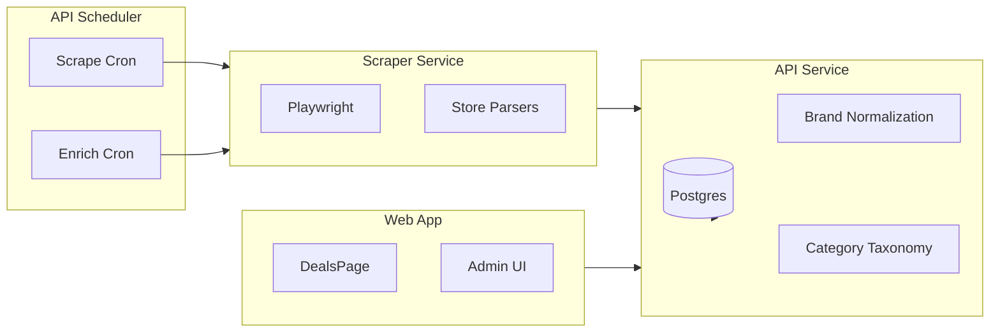

# Architecture

Overview of the MTB aggregator data flow, services, and design decisions.

## System Overview

## Services

| Service | Stack | Port | Role |
|---------|-------|------|------|
| API | Go (net/http, pgx) | 8080 | REST API, scheduler, orchestration |
| Scraper | Node.js + Express + Playwright | 3000 | Scrapes retailer sale pages |
| Web | React + Vite + TanStack Query | 5173 | Public deals UI, admin |

## Data Flow

### 1. Scrape Job (every 4h)

1. Scheduler triggers `POST /scrape-now` (or per-store via `?store=xxx`)
2. API iterates stores, calls Scraper `POST /scrape` with `url` + `store_type`
3. Scraper loads Playwright, runs store-specific parser, returns `ScrapeResult[]`
4. API upserts listings into `store_listings`, applies brand normalization, extracts metadata

### 2. Enrich Job (nightly, 2am)

1. Scheduler triggers `POST /enrich-now`
2. API fetches unenriched listings, groups by store
3. For each store with an enricher: Scraper visits PDP (product detail page) URLs
4. Parsers extract category path (breadcrumbs), specs (wheel size, travel, etc.)
5. API updates listings with `category_path`, `llm_specs`, and `category_id` (via taxonomy)

### 3. Category Taxonomy

- **Structured tree**: `categories` table (id, slug, name, parent_id) — single source of truth
- **Mappings**: `category_mappings` map raw store paths (e.g. `["Components", "Brakes"]`) to `category_id`
- **LLM classifier**: Optional LLM-based classification when no mapping exists

## Key Directories

| Path | Purpose |
|------|---------|
| `apps/api/internal/scheduler/` | Cron jobs, scrape/enrich orchestration |
| `apps/api/internal/db/` | All pgx queries |
| `apps/api/internal/brand/` | Brand aliases normalization |
| `apps/api/internal/taxonomy/` | Category mapping, in-memory cache |
| `apps/api/internal/metadata/` | Spec extraction from enriched data |
| `apps/scraper/src/parsers/` | One parser per store |

## Analytics

The web app uses [Vercel Web Analytics](https://vercel.com/docs/analytics) via `@vercel/analytics`. Enable Web Analytics in the Vercel project dashboard (Analytics → Enable) after deploying. Page views and visitors are tracked automatically.

**Custom events** (require Vercel Pro or an alternative such as PostHog) are wired via `track()` in [DealCard](apps/web/src/components/DealCard.tsx), [DealDetailModal](apps/web/src/components/DealDetailModal.tsx), [DealFilters](apps/web/src/components/DealFilters.tsx), and [SearchBar](apps/web/src/components/SearchBar.tsx):

- `deal_card_click` — user opens deal modal (deal_id, store, brand)
- `view_deal` / `view_at_store` — user clicks through to retailer (deal_id, store, brand)
- `filter_applied` — store, brand, category, sort, min_discount, or spec (type, value)
- `search` — search query (debounced)

See [.cursor/plans/website_analytics_plan_f835d1a0.plan.md](../.cursor/plans/website_analytics_plan_f835d1a0.plan.md) for details and alternatives.

## Environment & Deployment

- **Local**: Docker Postgres, three terminals (scraper, API, web)
- **Production**: Neon (DB), Render (API + scraper), Vercel (web), external cron (cron-job.org)

See [README.md](../README.md) for setup and [.cursor/plans/mtb_aggregator_deployment.plan.md](../.cursor/plans/mtb_aggregator_deployment.plan.md) for deployment details.
