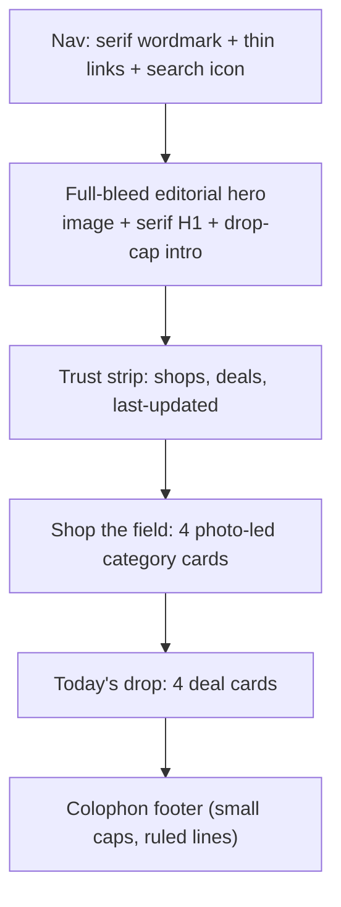
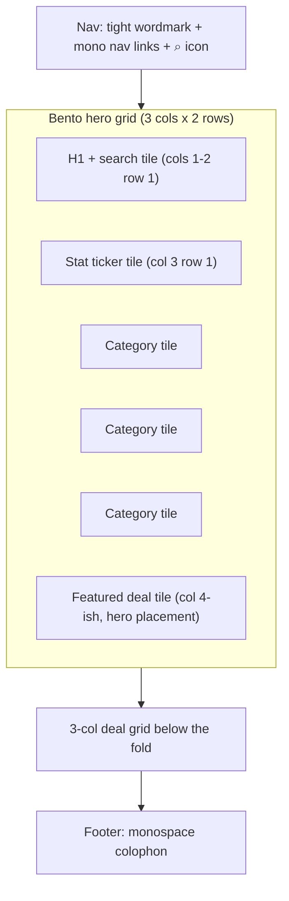

# Design redesign: Trail Atlas vs Workshop Modern

> **Decision artifact, not a styleguide.** This doc proposed two distinct visual directions for the public surface of [The Dropper](../apps/web). The chosen direction now drives the Pencil reference and the code rollout plan.
>
> **Audience:** owner / decision-maker.
> **Status:** **Direction C "Workshop Modern" picked** (2026-04-28). Single visible theme = light. Palette + type = "Concrete & Lime" + Geist Sans × Geist Mono. Direction B is preserved below as historical record.
> **Live preview:** run `pnpm --filter @mtb-aggregator/web run storybook` and open **Design / Workshop Modern Preview** to see and feel the new palette + primitives in the browser. Source: [`apps/web/src/components/WorkshopModernPreview.stories.tsx`](../apps/web/src/components/WorkshopModernPreview.stories.tsx). The preview wraps content in a `<div>` that sets both the shadcn semantic variables (`--primary`, etc.) **and** Tailwind's `--color-*` theme bridge to literal OKLCH values — Tailwind v4 utilities resolve `bg-primary` against `var(--color-primary)`, which is registered on `:root` as `var(--primary)`; without re-defining `--color-primary` on the preview frame, nested `--primary` overrides would not repaint utilities (you would still see production hazard orange `oklch(0.58 0.24 37)`).
> **Companion files:** [`apps/web/public/placeholders/`](../apps/web/public/placeholders) (4 generated hero plates, one set per direction).

---

## Why this exists

The current public UI ([HomePageContent](../apps/web/src/views/HomePageContent.tsx), [DealsPageContent](../apps/web/src/views/DealsPageContent.tsx), [DealDetail](../apps/web/src/app/(public)/deals/[id])) is a competent shadcn site. It's accessible and consistent — but it doesn't have a memorable point of view. We want a brand The Dropper can own.

Constraints from the kickoff conversation:

- High usability remains non-negotiable (e-commerce best practices from [Adam Fard](https://adamfard.com/blog/ecommerce-design) and [Shopify](https://www.shopify.com/blog/ecommerce-ux) stay in scope).
- Inspiration leans on [YT Industries](https://www.yt-industries.com/en-us), [Elevare Market](https://elevaremarket.com/en-qa), [Two Leaves Tea](https://twoleavestea.com/), and the [Awwwards e-commerce gallery](https://www.awwwards.com/websites/e-commerce/).
- One visible theme. Dark mode is deferred (token plumbing stays in code; the toggle UI goes).
- Nothing about the current visual identity is sacred — type, palette, and accent color are all in play.
- Better media everywhere. Placeholders are fine until we shoot real photography.

---

## Shared decisions (locked across both directions)

These apply regardless of which direction wins. The doc takes them as given so each direction can focus on its differentiators.

### Theme

- **One visible theme.** Remove the dark-mode toggle from [`NavHeader`](../apps/web/src/components/NavHeader.tsx) and the `<html class="dark">` writer in [`ThemeContext`](../apps/web/src/context/ThemeContext.tsx).
- Keep `:root` + `.dark` plumbing in [`globals.css`](../apps/web/src/app/globals.css) and the dual logo files in [`apps/web/public/`](../apps/web/public) so dark can return without rework.

### Information architecture (unchanged)

- URLs, filter behavior, category tree, search behavior all stay. This is a chrome refresh, not a re-architecture.
- The exception: deal-card hierarchy and the deal-detail suggestions module gain visual weight (see [§ E-commerce UX patterns](#e-commerce-ux-patterns-applied-to-both)).

### Media strategy

- **Placeholder pipeline (in this repo, today):**
  - 4 generated hero plates committed under [`apps/web/public/placeholders/`](../apps/web/public/placeholders):
    - Trail Atlas: `trail-atlas-hero-1.jpg` (dawn-ridge editorial), `trail-atlas-hero-2.jpg` (gritty drivetrain macro)
    - Workshop Modern: `workshop-modern-hero-1.jpg` (top-down disassembled component bench), `workshop-modern-hero-2.jpg` (carbon + machined macro)
  - Existing `stock-bikes.jpg`, `stock-components.jpg`, `stock-gear.jpg`, `stock-accessories.jpg` keep working for category cards.
- **Future:** real photography (and a category-image pass) is its own workstream — out of scope for this redesign.
- **Pencil parity:** the chosen direction's `.pen` file embeds the same `placeholders/*.jpg` files via `../apps/web/public/placeholders/...`, so the on-canvas preview matches what the browser would render.

### E-commerce UX patterns (applied to both)

Carried forward from [`docs/DESIGN.md`](DESIGN.md) and the inspiration sources, rendered in each direction's chrome:

- **Value-prop hero.** One sentence + supporting stat strip (shops scoured, live deals, last-updated time). Transparency, per Adam Fard's "build trust" guidance.
- **Persistent search.** Home hero search **and** an always-on search field in the [`Toolbar`](../apps/web/src/components/Toolbar.tsx) on `/deals`. Visual placeholder copy hints at fuzzy matching; behavior is a code follow-up.
- **Better deal-card hierarchy.** Savings amount (`$230 off`) and percentage (`35%`) both legible — current card under-uses the savings figure. Store moves from a corner badge to a typographic eyebrow. In-stock and variant-count cues stay.
- **Suggestion module on deal detail.** "More from {brand} · in {category} · under ${price}" rail using already-available API data — currently absent.
- **Empty / skeleton / error states.** Today's deal grid is mostly bare; both directions ship explicit treatments.
- **Mobile filter drawer.** UX (Vaul drawer, multi-select facets) stays. Only chrome changes.

### Logo

- The Dropper wordmark may need a redraw once new display type is chosen. **This doc proposes the type system; an actual logo redraw is a separate task.**
- The current dual logos (`logo.png` / `logo-light.png`) keep working for now; both directions specify how the lockup *should* feel.

---

## Direction B — Trail Atlas

> An editorial outdoor magazine that happens to sell mountain bike deals. Slow down, read the photography. Closest cousins: [Patagonia journal](https://www.patagonia.com/stories/), [Yeti Cycles](https://yeticycles.com/), [Cotopaxi](https://www.cotopaxi.com/), [Two Leaves Tea](https://twoleavestea.com/).

### Mood

Warm parchment canvas. Big cinematic photographs given room to breathe. Serif headlines treated like magazine cover lines. Deal cards feel like field notes. The site rewards lingering — the opposite of a coupon site.

**Reference plates** (committed):
- [`apps/web/public/placeholders/trail-atlas-hero-1.jpg`](../apps/web/public/placeholders/trail-atlas-hero-1.jpg) — dawn-ridge silhouette, warm rim light, large negative space for headline
- [`apps/web/public/placeholders/trail-atlas-hero-2.jpg`](../apps/web/public/placeholders/trail-atlas-hero-2.jpg) — golden-hour mud-caked drivetrain macro

### Palette — "Loam & Larch"

| Token | Role | OKLCH | sRGB hex |
| :--- | :--- | :--- | :--- |
| `--background` | Parchment canvas | `oklch(0.965 0.012 88)` | `#F5EFE3` |
| `--foreground` | Deep ink type | `oklch(0.16 0.012 240)` | `#1B1F26` |
| `--card` | Ivory card | `oklch(0.99 0.005 88)` | `#FBFAF6` |
| `--card-foreground` | (same as `--foreground`) | `oklch(0.16 0.012 240)` | `#1B1F26` |
| `--primary` | Ember CTA | `oklch(0.62 0.165 38)` | `#C66A3D` |
| `--primary-foreground` | Off-white on CTA | `oklch(0.99 0 0)` | `#FCFCFC` |
| `--secondary` | Deep moss panel | `oklch(0.34 0.058 145)` | `#2E4A35` |
| `--secondary-foreground` | Cream on moss | `oklch(0.97 0.006 95)` | `#F5F2EA` |
| `--muted` | Cream wash | `oklch(0.94 0.014 88)` | `#EFE7D6` |
| `--muted-foreground` | Quiet ink | `oklch(0.42 0.012 240)` | `#5A6068` |
| `--accent` | Bracken (eyebrows, chips) | `oklch(0.42 0.085 65)` | `#7A5630` |
| `--accent-foreground` | Cream on bracken | `oklch(0.97 0.012 88)` | `#F2EBDA` |
| `--destructive` | Barn red | `oklch(0.55 0.18 25)` | `#B14730` |
| `--border` | Soft taupe | `oklch(0.78 0.012 88)` | `#C7C0B3` |
| `--input` | Field stroke | `oklch(0.85 0.012 88)` | `#D8D2C5` |
| `--ring` | Focus = ember | `oklch(0.62 0.165 38)` | `#C66A3D` |

**Notes**
- Ember (warmer, redder, more clay) replaces hazard orange. Sits beautifully on parchment, reads like printed ink rather than safety vest.
- Deep moss is a sub-canvas for hero overlays and footer — used sparingly.
- Bracken is the eyebrow / micro-text color; gives small caps and meta info a printed-magazine feel.

### Type — Fraunces × Inter

| Role | Family | Variable file | Notes |
| :--- | :--- | :--- | :--- |
| Display (h1–h2) | **Fraunces** (variable, optical sizing) | `@fontsource-variable/fraunces` | Soft modulation, optical-size axis at large sizes for that magazine-cover quality. Use `font-optical-sizing: auto` and weights 300–600. |
| Body / UI | **Inter** (variable) | `@fontsource-variable/inter` | Workhorse sans for everything not display. Set as `--app-font-sans`. |
| Pull-quotes (optional) | Fraunces italic | (same package) | Editorial pull-quotes inside deal-detail when copy supports it. |

- **Wordmark direction:** "The Dropper" set in Fraunces, weight ~500, slight tracking, lowercase or small-caps lockup. Replaces the bold sans wordmark. Logo redraw to follow.
- **Sizes:**
  - h1 hero: 64–96px depending on viewport, line-height 1.05, drop cap on the first letter of the supporting paragraph
  - h2 section: 36–48px, line-height 1.15
  - body: 17px (slightly larger than today for reading comfort), line-height 1.55
  - eyebrow: 12px Inter, all-caps, letter-spacing 0.12em, color `--accent` (bracken)

### Home hero wireframe

```
┌─────────────────────────────────────────────────────────────────────┐
│  the dropper · journal of the trail            deals  about  ⌕     │
├─────────────────────────────────────────────────────────────────────┤
│                                                                     │
│  ╭───────────────────────────────────────────────────────────────╮  │
│  │   FULL-BLEED EDITORIAL HERO PHOTO                             │  │
│  │   (trail-atlas-hero-1.jpg, dawn-ridge silhouette)             │  │
│  │                                                               │  │
│  │   Today's drop.                  ← Fraunces 84px             │  │
│  │   Forty-seven shops scoured.     ← Inter 18px, drop cap       │  │
│  │   Eight thousand live deals.        on first paragraph        │  │
│  │                                                               │  │
│  │   [ search the trail               →]   [ browse all deals ] │  │
│  ╰───────────────────────────────────────────────────────────────╯  │
│                                                                     │
│  ──── scoured 12 min ago ──── 47 shops ──── 8,432 deals ────       │
│                                                                     │
│  Shop the field                                                     │
│  ┌──────────┐ ┌──────────┐ ┌──────────┐ ┌──────────┐                │
│  │ [photo]  │ │ [photo]  │ │ [photo]  │ │ [photo]  │                │
│  │ Bikes    │ │ Forks    │ │ Wheels   │ │ Helmets  │                │
│  │ view →   │ │ view →   │ │ view →   │ │ view →   │                │
│  └──────────┘ └──────────┘ └──────────┘ └──────────┘                │
│                                                                     │
│  Today's drop                              read all deals →         │
│  ┌──────────┐ ┌──────────┐ ┌──────────┐ ┌──────────┐                │
│  │ deal     │ │ deal     │ │ deal     │ │ deal     │                │
│  └──────────┘ └──────────┘ └──────────┘ └──────────┘                │
└─────────────────────────────────────────────────────────────────────┘
```



### Component sketches

- **Nav.** Serif wordmark, thin underlined hover, inline search icon expanding to a parchment-panel input. No theme toggle.
- **Deal card.** Cream `--card` background, image with 8px corner radius, **bracken eyebrow** for brand (small caps), **serif** product name (Fraunces 18–20px), price block with ember savings (`save $230`) above slash-through original, `Snag the deal` CTA in ember.
- **Category card.** Editorial photo crop (4:3), serif label below, "view deals →" in ember.
- **Filter chip.** Outlined (1px taupe border), no fill, ink text. Selected state: ember outline + ember dot.
- **Filter sidebar.** Card-on-card with thin `--border` rules between facet groups, label as small-caps eyebrow.
- **Pagination.** Numerals in Fraunces (medium), arrows as serif glyphs (← →), current page underlined in ember.
- **Deal detail.** Two-column hero: gallery left, sticky meta column right (price, CTA, suggestions). Spec table styled like a magazine sidebar.
- **Footer.** Colophon-style: thin rule, small-caps section labels, italic credits ("scraped honestly · since 2025").

### Tailwind v4 `@theme` drop-in

```css
@theme {
  --color-background: var(--background);
  --color-foreground: var(--foreground);
  --color-card: var(--card);
  --color-card-foreground: var(--card-foreground);
  --color-primary: var(--primary);
  --color-primary-foreground: var(--primary-foreground);
  --color-secondary: var(--secondary);
  --color-secondary-foreground: var(--secondary-foreground);
  --color-muted: var(--muted);
  --color-muted-foreground: var(--muted-foreground);
  --color-accent: var(--accent);
  --color-accent-foreground: var(--accent-foreground);
  --color-destructive: var(--destructive);
  --color-border: var(--border);
  --color-input: var(--input);
  --color-ring: var(--ring);

  --radius-lg: var(--radius);
  --radius-md: calc(var(--radius) - 2px);
  --radius-sm: calc(var(--radius) - 4px);

  --font-sans: var(--app-font-sans), ui-sans-serif, system-ui, sans-serif;
  --font-display: var(--app-font-display), ui-serif, Georgia, serif;
}

@layer base {
  :root {
    --app-font-sans: "Inter Variable", ui-sans-serif, system-ui, sans-serif;
    --app-font-display: "Fraunces Variable", ui-serif, Georgia, serif;

    --background: oklch(0.965 0.012 88);
    --foreground: oklch(0.16 0.012 240);
    --card: oklch(0.99 0.005 88);
    --card-foreground: oklch(0.16 0.012 240);
    --primary: oklch(0.62 0.165 38);
    --primary-foreground: oklch(0.99 0 0);
    --secondary: oklch(0.34 0.058 145);
    --secondary-foreground: oklch(0.97 0.006 95);
    --muted: oklch(0.94 0.014 88);
    --muted-foreground: oklch(0.42 0.012 240);
    --accent: oklch(0.42 0.085 65);
    --accent-foreground: oklch(0.97 0.012 88);
    --destructive: oklch(0.55 0.18 25);
    --border: oklch(0.78 0.012 88);
    --input: oklch(0.85 0.012 88);
    --ring: oklch(0.62 0.165 38);
    --radius: 0.5rem;
  }

  h1, h2 { font-family: var(--font-display); font-optical-sizing: auto; }
  h3 { font-family: var(--font-display); font-weight: 500; }
}
```

### Font install (Trail Atlas)

```bash
pnpm --filter @mtb-aggregator/web add @fontsource-variable/fraunces @fontsource-variable/inter
```

Then in [`globals.css`](../apps/web/src/app/globals.css), replace the existing fontsource imports:

```css
@import "@fontsource-variable/inter";
@import "@fontsource-variable/fraunces";
```

### Accessibility — contrast pairs

| Pair | Ratio | WCAG |
| :--- | :--- | :--- |
| `--foreground` on `--background` | ~14.7 : 1 | AAA |
| `--foreground` on `--card` | ~15.4 : 1 | AAA |
| `--muted-foreground` on `--background` | ~4.9 : 1 | AA |
| `--primary-foreground` on `--primary` (ember CTA) | ~4.7 : 1 | AA (large) — verify per-final tone, lift `--primary` toward 0.59 if borderline |
| `--accent-foreground` on `--accent` (bracken) | ~7.2 : 1 | AAA |
| Focus `--ring` outline on `--background` | ~3.6 : 1 | AA non-text |

Numbers above are estimates from OKLCH conversion; final pass uses [oklch.com](https://oklch.com) + axe in Storybook.

### Same / different vs today

**Same:** layout grid, search-first home, category cards, deal grid, filter sidebar, mobile drawer, "Snag the deal" copy, dark-mode tokens preserved in `:root` plumbing.

**Different:** serif display + sans body (Fraunces × Inter, replacing Bricolage × Plus Jakarta), parchment canvas (vs grey-green), ember CTA (vs hazard orange), bracken eyebrows (vs muted-foreground greys), no theme toggle, drop caps in hero copy, larger reading sizes, photo-led category cards, editorial colophon footer.

### Risks

- **Drift toward "premium spa" if photography or copy soften.** Mitigation: lean gritty in product photography (mud, machined parts, action), keep copy direct ("47 shops scoured", "snag the deal").
- **Largest LCP image is now bigger.** Mitigation: hero JPG at 75% quality + `sizes`/`srcset`, eager-load only above-the-fold hero, lazy-load all deal-grid imagery.
- **Serif body is unreadable on small screens.** We sidestep this by keeping body/UI in Inter — Fraunces is display-only.

---

## Direction C — Workshop Modern

> A precision-tool storefront for someone who notices kerning. Closest cousins: [Linear](https://linear.app/), [Vercel store](https://vercel.com/shop), [Frank](https://www.frank.tools/), [Yeti / Pinarello configurators](https://yeticycles.com/), [Awwwards e-commerce winners](https://www.awwwards.com/websites/e-commerce/).

### Mood

Cool stone canvas, paper-white cards, ink-near-black type. Numbers in mono so prices and savings read like CAD readouts. A single confident accent — **electric lime** — used as a scalpel, not a marker. Bento-grid hero replaces the centered hero. Spec rows feel like a parts list.

**Reference plates** (committed):
- [`apps/web/public/placeholders/workshop-modern-hero-1.jpg`](../apps/web/public/placeholders/workshop-modern-hero-1.jpg) — top-down disassembled MTB components on a graphite bench
- [`apps/web/public/placeholders/workshop-modern-hero-2.jpg`](../apps/web/public/placeholders/workshop-modern-hero-2.jpg) — carbon-weave + machined linkage macro

### Palette — "Concrete & Lime"

| Token | Role | OKLCH | sRGB hex |
| :--- | :--- | :--- | :--- |
| `--background` | Cool stone canvas | `oklch(0.96 0.004 240)` | `#F1F2F4` |
| `--foreground` | Near-black ink | `oklch(0.18 0.005 240)` | `#202327` |
| `--card` | Paper white card | `oklch(0.995 0.002 240)` | `#FCFCFD` |
| `--card-foreground` | (same as `--foreground`) | `oklch(0.18 0.005 240)` | `#202327` |
| `--primary` | Electric lime CTA | `oklch(0.85 0.18 130)` | `#C7E635` |
| `--primary-foreground` | Ink on lime | `oklch(0.18 0.005 240)` | `#202327` |
| `--secondary` | Subtle stone tile | `oklch(0.93 0.005 240)` | `#E9EAEC` |
| `--secondary-foreground` | (same as `--foreground`) | `oklch(0.18 0.005 240)` | `#202327` |
| `--muted` | Slightly cooler stone | `oklch(0.92 0.005 240)` | `#E5E6E8` |
| `--muted-foreground` | Graphite | `oklch(0.45 0.005 240)` | `#6E7278` |
| `--accent` | Graphite-blue info | `oklch(0.55 0.04 240)` | `#6F7782` |
| `--accent-foreground` | Off-white | `oklch(0.99 0 0)` | `#FCFCFC` |
| `--destructive` | Signal red | `oklch(0.58 0.22 25)` | `#C04532` |
| `--border` | Warm grey rule | `oklch(0.85 0.005 240)` | `#D2D4D7` |
| `--input` | Field stroke | `oklch(0.88 0.005 240)` | `#DADCDF` |
| `--ring` | Focus = lime | `oklch(0.85 0.18 130)` | `#C7E635` |

**Notes**
- **Lime on ink** is the brand signature. Keep it scarce: primary CTA, focused state, single keyword highlight in hero, savings amount on hover. Anything more dilutes it.
- Picked over caution-yellow because lime against near-black is one of the most-recognized signatures in tech retail (Razer, Nothing, Specialized hi-vis range) without being a school-bus cliché.
- **No orange anywhere** — clean break from current.

### Type — Geist Sans × Geist Mono

| Role | Family | Variable file | Notes |
| :--- | :--- | :--- | :--- |
| Display + body | **Geist Sans** (variable) | `@fontsource-variable/geist` | Tight neo-grotesk by Vercel; pairs perfectly with Geist Mono. One sans for everything from H1 to UI. |
| Numbers + meta + chips | **Geist Mono** (variable) | `@fontsource-variable/geist-mono` | Prices, savings, percentages, store chips, stat strip, spec keys. Tabular numerals always on. |

- **Wordmark direction:** "THE DROPPER" set in Geist Sans 600, all caps, letter-spacing +0.04em, with a small mono `// V2` style tag underneath if we want to lean into versioning. Replaces current bold sans lockup.
- **Sizes:**
  - h1 hero: 56–72px Geist Sans 600, line-height 1.0, letter-spacing -0.02em
  - h2 section: 28–36px Geist Sans 500
  - body: 15px Geist Sans 400, line-height 1.5
  - mono price: 28–40px Geist Mono 500, tabular numerals
  - mono eyebrow: 12px Geist Mono 500, all-caps, letter-spacing +0.08em
  - mono chip: 12px Geist Mono 400 inside 4px-radius pill

### Home hero wireframe (bento)

```
┌────────────────────────────────────────────────────────────────────┐
│ THE DROPPER //                       DEALS  BRANDS  ABOUT      ⌕  │
├────────────────────────────────────────────────────────────────────┤
│                                                                    │
│ ┌────────────────────────────────────┐ ┌─────────────────────────┐ │
│ │  Stop searching.                   │ │  // TODAY               │ │
│ │  Start shredding.                  │ │  47   SHOPS             │ │
│ │                                    │ │  8,432 LIVE DEALS       │ │
│ │  ⌕ search 8,432 deals          [→]│ │  12 MIN AGO             │ │
│ │                                    │ │                         │ │
│ │  H1 in Geist Sans 600              │ │  mono ticker, lime dot  │ │
│ └────────────────────────────────────┘ └─────────────────────────┘ │
│ ┌──────────┐ ┌──────────┐ ┌──────────┐ ┌─────────────────────────┐ │
│ │ // FORKS │ │ // HELMS │ │ // WHEELS│ │  // FEATURED DEAL       │ │
│ │ [img]    │ │ [img]    │ │ [img]    │ │  [hero deal card]       │ │
│ │ 124 →    │ │ 88   →   │ │ 211  →   │ │  $230 OFF · 35%         │ │
│ └──────────┘ └──────────┘ └──────────┘ └─────────────────────────┘ │
│                                                                    │
└────────────────────────────────────────────────────────────────────┘
```



### Component sketches

- **Nav.** Tight wordmark + mono uppercase links (`DEALS`, `BRANDS`, `ABOUT`) with letter-spacing, search icon expands inline to a paper-white field with mono placeholder. No theme toggle.
- **Deal card.** Paper-white card, image at top with 4px radius, `// BRAND` mono eyebrow, sans product name (Geist 16/18 medium), **savings amount in mono** as the dominant price element (`$230 off`), original price slash-through small, percentage as a mono pill (`35%`), store name as a bottom mono chip (`// WORLDWIDECYCLERY`). `Snag the deal` CTA: ink button on hover → lime fill, 4px radius.
- **Category tile (bento).** `// CATEGORY` mono eyebrow, image (object-cover), count in mono (`124 →`).
- **Stat ticker tile.** Three rows of `metric_value (mono) · LABEL (mono caps)`, lime dot before "live" stat, small "updated 12 min ago" footer.
- **Filter chip.** Rectangular, 4px radius, mono label, `×` close glyph in mono. Selected: ink fill, lime text.
- **Filter sidebar.** Mono section labels, sans facet values, count in mono (`SRAM 234`).
- **Pagination.** `‹ PREV` / `NEXT ›` in mono, current page boxed in mono, ellipsis in mono.
- **Deal detail.** Two-column: gallery left, meta column right. Spec table styled as a parts list — left cell mono key, right cell sans value, thin `--border` rules between rows, no zebra striping.
- **Footer.** Mono colophon, lime accent on link hover, "// scraped honestly" tagline.

### Tailwind v4 `@theme` drop-in

```css
@theme {
  --color-background: var(--background);
  --color-foreground: var(--foreground);
  --color-card: var(--card);
  --color-card-foreground: var(--card-foreground);
  --color-primary: var(--primary);
  --color-primary-foreground: var(--primary-foreground);
  --color-secondary: var(--secondary);
  --color-secondary-foreground: var(--secondary-foreground);
  --color-muted: var(--muted);
  --color-muted-foreground: var(--muted-foreground);
  --color-accent: var(--accent);
  --color-accent-foreground: var(--accent-foreground);
  --color-destructive: var(--destructive);
  --color-border: var(--border);
  --color-input: var(--input);
  --color-ring: var(--ring);

  --radius-lg: var(--radius);
  --radius-md: calc(var(--radius) - 2px);
  --radius-sm: calc(var(--radius) - 4px);

  --font-sans: var(--app-font-sans), ui-sans-serif, system-ui, sans-serif;
  --font-mono: var(--app-font-mono), ui-monospace, SFMono-Regular, Menlo, monospace;
  --font-display: var(--app-font-display), ui-sans-serif, system-ui, sans-serif;
}

@layer base {
  :root {
    --app-font-sans: "Geist Variable", ui-sans-serif, system-ui, sans-serif;
    --app-font-mono: "Geist Mono Variable", ui-monospace, SFMono-Regular, monospace;
    --app-font-display: "Geist Variable", ui-sans-serif, system-ui, sans-serif;

    --background: oklch(0.96 0.004 240);
    --foreground: oklch(0.18 0.005 240);
    --card: oklch(0.995 0.002 240);
    --card-foreground: oklch(0.18 0.005 240);
    --primary: oklch(0.85 0.18 130);
    --primary-foreground: oklch(0.18 0.005 240);
    --secondary: oklch(0.93 0.005 240);
    --secondary-foreground: oklch(0.18 0.005 240);
    --muted: oklch(0.92 0.005 240);
    --muted-foreground: oklch(0.45 0.005 240);
    --accent: oklch(0.55 0.04 240);
    --accent-foreground: oklch(0.99 0 0);
    --destructive: oklch(0.58 0.22 25);
    --border: oklch(0.85 0.005 240);
    --input: oklch(0.88 0.005 240);
    --ring: oklch(0.85 0.18 130);
    --radius: 0.375rem;
  }

  h1, h2, h3 {
    font-family: var(--font-display);
    letter-spacing: -0.02em;
  }
  code, kbd, samp, .mono { font-family: var(--font-mono); }
  .num-tabular { font-variant-numeric: tabular-nums; }
}
```

### Font install (Workshop Modern)

```bash
pnpm --filter @mtb-aggregator/web add @fontsource-variable/geist @fontsource-variable/geist-mono
```

Replace the existing fontsource imports in [`globals.css`](../apps/web/src/app/globals.css):

```css
@import "@fontsource-variable/geist";
@import "@fontsource-variable/geist-mono";
```

### Accessibility — contrast pairs

| Pair | Ratio | WCAG |
| :--- | :--- | :--- |
| `--foreground` on `--background` | ~14.5 : 1 | AAA |
| `--foreground` on `--card` | ~15.6 : 1 | AAA |
| `--muted-foreground` on `--background` | ~4.7 : 1 | AA |
| `--primary-foreground` on `--primary` (ink on lime) | ~12.8 : 1 | AAA |
| `--accent-foreground` on `--accent` (graphite info) | ~5.1 : 1 | AA |
| Focus `--ring` outline on `--background` | ~2.1 : 1 (low — lime is light on stone) | **Risk — see note** |

> **Lime ring caveat.** The focus ring against a near-white canvas can fall under 3:1. Recommended fix: 2px lime ring **plus** a 1px ink offset ring (`focus-visible:ring-2 ring-primary outline outline-1 outline-foreground/40`). This keeps the brand signature visible on focused chips and CTAs without breaking AA.

### Component personality

> **Why this matters.** A token + font swap doesn't make a redesign — the primitives have to *act* different. Each primitive below has been built as a working prototype in [`WorkshopModernPreview.stories.tsx`](../apps/web/src/components/WorkshopModernPreview.stories.tsx); read this section alongside the Storybook story.

#### Buttons

The "shop" personality lands in micro-interactions, not pure form. Three rules apply across every variant:

- **Mono labels, all-caps, +0.12em tracking.** Buttons read like switch panels.
- **Tactile press.** Every variant translates -1px on `:active` (no shadows; the press *feels* mechanical, not floaty).
- **Sharp corners (4px radius).** No friendly pills.

| Variant | Visual signature | Behavior |
| :--- | :--- | :--- |
| **Primary CTA — "Lime Switch"** | Ink fill (`bg-foreground`) with a **4px lime stripe** on the left edge. | On hover the stripe slides rightward to fill the entire button (300ms ease-out); the label color crossfades from off-white → ink. The optional leading `[01]` ID code can prefix high-priority CTAs ("[01] SNAG THE DEAL →") to lean the workshop metaphor harder. |
| **Secondary** | 1px ink border on a paper-white card surface. | On hover, ink fills the entire button; label flips to off-white. No stripe — the "fill" *is* the interaction. |
| **Ghost** | No fill, no border. Mono label with a leading `▸` tick that's hidden by default. | On hover, the tick fades in and slides left; label gains a thin underline. Trailing `↗` glyph is permanent (signals "this leaves the current view"). |
| **Destructive** | Signal-red 1px border, signal-red mono label, leading `×`. | On hover, signal-red fills, label flips white. Reserved for clear/reset actions in the filter sidebar and admin. |
| **Icon** | 36×36 square, ink-stroke border, mono glyph (`⌕ ☰ ↗ ×`). | Same hover-fill behavior as Secondary. |

#### Cards

The deal card is the marquee primitive. Three signature features make it feel different from a shadcn card:

1. **CAD crop marks.** Two L-shaped 1px strokes anchor the top-left and bottom-right corners — the universal symbol for "this is a measured drawing." Subtle but unmistakable.
2. **Lime SKU tab.** A small lime pill sits *outside* the card's top edge with a mono SKU code (`// A07-2F`). The card looks tagged, like a workshop-floor part with a job number stuck on. SKU is auto-derived (e.g. first 3 chars of the deal ID + a check digit).
3. **Save-amount-first hierarchy.** The savings figure (`$230`) is the dominant typographic element on the card, set in mono at 24px. The original price sits small and slashed in the top-right; the discount % becomes the rotated lime "sticker" badge on the image. This inverts the current card, which leads with the % off and buries the savings amount.

Hover behavior: `-2px` Y lift + 1px-→-1.5px border weight thickening + image `scale(1.03)` over 200ms. No drop-shadow.

#### Category tile (bento)

Photo top, ink panel sliding over the bottom edge. The panel reverses contrast (ink fill, off-white text, lime accent on the count + arrow), so the tile reads as a piece of *signage* over the photograph. Hover: photo scales 1.04x; lime arrow translates +4px.

#### Stat ticker tile

Ink fill, off-white type, **pulsing lime dot before "// LIVE"**. Three rows of mono numerals with hairline dividers. The bottom-most line is intentionally smaller and more muted — last-sweep timestamp + the most recent stores hit. Reads like a server-room status panel.

#### Inputs

| Primitive | Visual signature |
| :--- | :--- |
| **Search input — "open frame"** | Top + bottom rules only (no left/right border). Mono placeholder, leading `⌕`, trailing `⌘ K` keyboard-shortcut chip in a stone pill. On focus, the bottom rule thickens 1→2px and recolors lime — a deliberate "fill-in-the-blank" form aesthetic. |
| **Text input** | Same open-frame body. Mono floating label sits above; muted in default state, ink when filled (`// EMAIL`). |
| **Stamp checkbox** | 18×18 ink-stroke square. Checked state: lime fill **with an inner ink-square mark** (not a checkmark). The square-in-square reads as a "stamped/selected" engineering indicator and avoids the consumer-checkmark cliché. Pairs naturally with the parts-list metaphor. |
| **Native select** | Open-frame underline same as text input + a mono `▾` glyph trailing the selected value. |

#### Chips, badges, pagination

- **Filter chip (selected):** ink fill, lime mono label, leading `//` prefix, trailing `×` button rendered as a tiny lime square. Unselected chip is just a 1px ink-stroke border. Only the selected chip gets color.
- **Discount sticker:** lime fill, mono `−35%`, **2px hard ink shadow** (`shadow-[2px_2px_0_var(--foreground)]`, no blur), tilted -2deg. Stays on the deal-card image. Reads as a sticker pressed onto the photograph.
- **Variant badge:** mono `4 VARIANTS` in a 4px-radius pill with subtle stroke. Lower visual weight than the discount sticker — these are info, not decoration.
- **Store chip (eyebrow):** plain mono `// WORLDWIDECYCLERY`. Text-only, no fill. Used as a typographic eyebrow on the deal card and in the filter sidebar.
- **Pagination:** boxed mono numerals, current page = lime fill on ink stroke. Prev/next as `‹ PREV` / `NEXT ›` ghost buttons with hover-to-ink-fill behavior.

#### Section dividers

`§ 02` mono section number + sans display heading + a thin border rule extending to the right edge. Borrowed from book/manual typesetting. Dividers replace the usual centered "Top deals of the day" hand-wavy heading.

#### Empty / loading / error

These are first-class components, not afterthoughts:

- **Empty:** dashed border on a paper card, ink ⊘ glyph, mono `// NO DEALS MATCH` heading, sans body, secondary "Reset filters" CTA. Always paired with a recovery action.
- **Loading:** thin ink-stroke pill, pulsing lime dot, `// LOADING` mono header + lowercase sans subtext (`scanning 47 shops, fetching latest stock`). Distinct from a generic spinner.
- **Error:** signal-red border on a 5%-tinted destructive surface, mono `// ERROR · CODE 502` header, sans body with a link to `/status`. Reads like a CLI error, not a user-facing apology.

#### Motion

Restrained and mechanical:

- **Default duration:** 200ms ease-out (most). 300ms for the lime-switch CTA stripe (longer feels deliberate, like throwing a physical lever).
- **No bounce.** No spring physics. No floaty drop-shadows.
- **One animated brand element on the page at a time:** the pulsing lime dot in the stat ticker. Everything else holds still until interacted with.

### Same / different vs today

**Same:** layout grid, search-first home, category cards, deal grid, filter sidebar, mobile drawer, "Snag the deal" copy, dark-mode tokens preserved in `:root` plumbing.

**Different:** Geist Sans + Geist Mono pairing (replacing Bricolage × Plus Jakarta), cool stone canvas (vs warm grey-green), **no orange — electric lime accent**, no theme toggle, **bento hero** (replacing centered search hero), prices and stats in mono, savings-amount-first deal card hierarchy (vs %-first), tighter 6px radius (vs ~10px today), spec table as parts list.

### Risks

- **Lime is divisive.** Mitigation: spec it sparingly (CTA + focus + a single keyword highlight). Side-by-side hero variants in Storybook before approval.
- **Mono + neo-grotesk can feel sterile.** Mitigation: lean on photography warmth and white-space rhythm; never set body in mono.
- **Bento collapses on mobile** to a stacked single column. Mobile spec mirrors today's vertical stack with mono ticker pinned above category cards. Explicit mobile wireframe to follow in Pencil.

---

## Side-by-side at a glance

| Axis | Trail Atlas (B) | Workshop Modern (C) |
| :--- | :--- | :--- |
| **Mood** | Editorial outdoor magazine | Engineering shop |
| **Canvas** | Warm parchment | Cool stone |
| **Display type** | Fraunces (serif, optical sizing) | Geist Sans (neo-grotesk) |
| **Body type** | Inter | Geist Sans |
| **Accent type** | none | Geist Mono on numbers |
| **CTA color** | Ember `#C66A3D` | Electric lime `#C7E635` |
| **Hero layout** | Full-bleed photo + serif H1 + drop cap | Bento grid (H1 + search + ticker + featured) |
| **Deal-card emphasis** | Brand eyebrow + serif name + ember savings | Mono savings amount as dominant element |
| **Radius** | 8px | 6px |
| **Best at** | Storytelling, brand stickiness, premium feel | Density, scannability, "tool-like" precision |
| **Worst at** | Density on the deals grid | Warmth, casual browsing energy |
| **Bundle adds** | ~75kB woff2 (Fraunces + Inter) | ~85kB woff2 (Geist Sans + Mono) |

---

## Implementation roadmap (after a direction is picked)

This section is included so the rollout sequence is visible, not actionable in this doc.

1. **Phase 2 — Pencil reference.** Update `pencil-new.pen` with three frames (Home, Deals list, Deal detail) using the chosen direction's tokens and type. Save to `designs/mtb-public-ui-v3.pen`. Requires the Pencil MCP server back online (currently `errored` — flagged in [`docs/DESIGN.md`](DESIGN.md) follow-up).
2. **Phase 3 — Code rollout.** Sequenced PRs:
   1. Token swap in [`globals.css`](../apps/web/src/app/globals.css), font install, [`NavHeader`](../apps/web/src/components/NavHeader.tsx) toggle removal, [`ThemeContext`](../apps/web/src/context/ThemeContext.tsx) write removal.
   2. Card primitives + deal-card hierarchy refresh ([`DealCard`](../apps/web/src/components/DealCard.tsx), [`CategoryCard`](../apps/web/src/components/CategoryCard.tsx)).
   3. Hero layout (home) + bento or editorial composition.
   4. Deal-detail revisions: gallery, sticky meta, suggestions module, parts-list spec table.
   5. Filter chrome refresh ([`FilterSidebar`](../apps/web/src/components/FilterSidebar.tsx), [`FilterChips`](../apps/web/src/components/FilterChips.tsx), [`FilterDrawer`](../apps/web/src/components/FilterDrawer.tsx)).
   6. Empty / skeleton / error states.
   7. Storybook updates: design-token preview, primitive stories.
   8. Logo redraw (separate task).
3. **Phase 4 — Photography.** Replace placeholders, source category-card photography, run a hero rotation.

---

## Open assumptions (still need validation)

| Assumption | Source | What changes if it's wrong |
| :--- | :--- | :--- |
| Brand name + voice ("The Dropper", "Dialed-in deals.", "Snag the Deal") stay | Today's [`docs/DESIGN.md`](DESIGN.md) and copy across the app | Headline, eyebrow, and CTA copy are reused across both directions; if voice shifts, every direction's hero text gets rewritten. |
| Adding 1–2 new font families is OK | Implicit in both directions | If we have to keep Bricolage / Plus Jakarta, both directions weaken (especially C — mono is its hook). |
| Real photography is a separate workstream | Stated in shared decisions | If real photography lands during redesign, hero crops + category-card crops change. |
| Logo redraw can lag the redesign | Stated above | If logo must ship with the redesign, +1 task. |

---

## Decision checklist

- [x] **Direction.** Workshop Modern (C). _2026-04-28._
- [x] **Single visible theme.** Light. _2026-04-28._
- [x] **Type pairing.** Geist Sans × Geist Mono. Packages installed (`@fontsource-variable/geist`, `@fontsource-variable/geist-mono`). _2026-04-28._
- [x] **Placeholder hero plates.** Approved (4 images committed under [`apps/web/public/placeholders/`](../apps/web/public/placeholders)). _2026-04-28._
- [ ] **Palette feel-check.** Approve "Concrete & Lime" after seeing it live in Storybook — see _Live preview_ note at the top of this doc.
- [ ] **Component personality.** Approve the primitive treatments in [Component personality](#component-personality) (CAD crop marks, lime-switch CTA, stamped checkbox, save-amount-first card, etc.) after viewing in Storybook.
- [ ] **Logo redraw can lag.** OK to ship the redesign with the existing wordmark and treat a new lockup as a follow-up.

Once the remaining boxes are checked, we move to Phase 2 (Pencil rebuild) and queue Phase 3 (code rollout) as a separate plan.

---

## Inspiration credits

- [adamfard.com/blog/ecommerce-design](https://adamfard.com/blog/ecommerce-design)
- [shopify.com/blog/ecommerce-ux](https://www.shopify.com/blog/ecommerce-ux)
- [yt-industries.com/en-us](https://www.yt-industries.com/en-us)
- [elevaremarket.com/en-qa](https://elevaremarket.com/en-qa)
- [twoleavestea.com](https://twoleavestea.com/)
- [awwwards.com/websites/e-commerce](https://www.awwwards.com/websites/e-commerce/)
