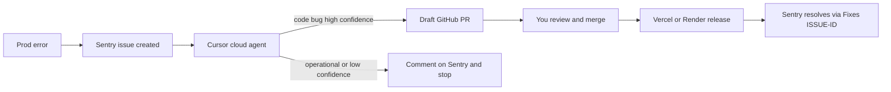

# Sentry → draft PR (ZAC-210)

## Problem Statement

How might we turn **new production application errors** into reviewable fix PRs for a solo operator, without Linear tickets and without spending cloud-agent runs on scraper/WAF/quota/empty-scrape noise this repo already reports to Sentry?

## Recommended Direction

**One Cursor Automation.** Sentry issue created → cloud agent classifies → draft GitHub PR or a Sentry comment. No Linear hop. No GitHub Actions glue. No auto-merge.

Success is a **draft PR you review at leisure**, not a closed Sentry issue and not a ticket on the board. Linear is extra process without a teammate. The PR is the work item.

The interesting product is the **abort list**, not the wiring. Cursor already has a native Sentry trigger ([Investigate Sentry issues](https://cursor.com/workflows/autonomous-agents/investigate-sentry-issues)). This repo already reports operational failures that are not “write a patch”: WAF, LLM quota, empty scrapes, aggregated enrich errors, client transition timeouts. An unfiltered loop would spam GitHub.



**Trigger:** Sentry **issue created**, **production** only, org **`the-dropper`** (`https://the-dropper.sentry.io`, region `us`):

| Project | Numeric id | v1 |
| --- | --- | --- |
| `mtb-aggregator-web` | `4511072856113152` | In |
| `mtb-aggregator-api` | (slug is enough in the editor) | In |
| `mtb-aggregator-scraper` | — | Out |

Short IDs look like `MTB-AGGREGATOR-WEB-C`.

**Agent policy — classify first:**

- **Draft PR** only when the stack maps to this repo, the root cause is a contained code bug (1–3 files), and a scoped CI test command can cover it.
- **Comment on the Sentry issue and stop** for operational/transient/infra: WAF, Playwright/retailer HTML, Impact 5xx, `llm_error=quota_exhausted`, `phase=listing_errors_aggregate`, consecutive empty scrape, missing secrets, rate limits, third-party outages — and the live web noise already in prod: `Deals transition timed out` (`usePendingTimeout`), `fetch failed`, `Unexpected token '<'` (HTML instead of JSON).
- **Never** “fix” by swallowing errors, adding WAF retries, deleting Sentry calls, or widening `try/catch`.
- Use **Memories** so the same issue ID is not investigated twice.
- If install or tests cannot run in the cloud VM, comment on Sentry and **do not open a PR**.

**Draft PRs only.** Never mark ready-for-review. Never auto-merge. Never have the agent mark the Sentry issue resolved — GitHub `Fixes` + a production release does that.

### Live snapshot (Aug 2026)

Unresolved, `environment:production`:

- **Web (30d):** 5 issues. Code-bug candidate: [MTB-AGGREGATOR-WEB-C](https://the-dropper.sentry.io/issues/MTB-AGGREGATOR-WEB-C) — `BrandLinks.tsx:39`, `n.children.length` on `/deals/brand/100-percent`. First-party frames resolved. The other four are abort-class or opaque (timeout warning, fetch failed, HTML parse, generic RSC digest).
- **API (90d):** none. Still include the project. Confirm Render sets `SENTRY_ENVIRONMENT=production`; a blank env would miss the production-only trigger.

Volume is low enough to turn the automation on without extra inbound filters.

## Key Assumptions to Validate

- [x] **Volume is sane** — web: 5 unresolved prod issues / 30d; API: none. Enable without inbound filters first.
- [x] **Web stacks map** — WEB-C shows first-party `apps/web` frames. Still confirm API when an API issue appears.
- [ ] **Abort policy holds** — of the first ~10 runs, timeout/fetch/HTML issues get a Sentry comment and **no PR**. If the agent still opens junk PRs, tighten the prompt; do not add Linear as a band-aid.
- [ ] **Cloud env can run the named test commands** — first canary must show `pnpm` / `go test` succeeding. If not, fix `.cursor/environment.json` / Dockerfile before leaving the automation on.
- [ ] **Fixes are net-positive** — you would merge at least some of the first draft PRs after a normal review. If the first three are wrong, turn it off.
- [ ] **`Fixes SHORT-ID` + GitHub integration + release** actually resolves the issue after deploy. Test on the first merged PR.
- [ ] **Draft PRs are visible enough** — GitHub notifications replace Slack/Linear. Add Slack later if you miss them, not tickets.

## MVP Scope

Config and prompt. Not an app feature sprint.

**In**

- One Cursor Automation on `mtb-aggregator`. Cloud environment. PR creation on. **Draft** PRs.
- Sentry MCP **in the automation** (Inspect issues + Triage so it can comment). That is the dashboard Sentry connection, not local [`.cursor/mcp.json`](../../.cursor/mcp.json).
- Trigger: issue created, production, `mtb-aggregator-web` + `mtb-aggregator-api`.
- Instructions: classify → abort list above → minimal fix → named CI test for the slice that changed → draft PR with `Fixes <SHORT-ID>` and the issue URL in the **body**, or a Sentry comment if skipped.
- Branch: `fix/<sentry-short-id>-<slug>`.
- **Cloud env:** [`.cursor/environment.json`](../../.cursor/environment.json) + [`.cursor/Dockerfile`](../../.cursor/Dockerfile) (Ubuntu 24.04, Node 20, pnpm 9.14.2, Go 1.26.5). Install: `pnpm install --frozen-lockfile`, build `@mtb-aggregator/logging`, `go mod download` in `apps/api`. No Postgres, Playwright, or Docker Compose. Prompt names exact verify commands from [`.github/workflows/ci.yml`](../../.github/workflows/ci.yml).
- **GitHub auto-resolve** (follow-up, with the automation):
  1. Sentry org `the-dropper` → Settings → Integrations → GitHub → grant `mtb-aggregator`.
  2. Code mappings on the in-projects (web already maps `BrandLinks.tsx`).
  3. PR body includes `Fixes MTB-AGGREGATOR-WEB-C` (example) plus the issue URL. Sentry annotates immediately; it **resolves when that commit is in a release**.
  4. Releases already exist: web `VERCEL_GIT_COMMIT_SHA`, API `RENDER_GIT_COMMIT` / `SENTRY_RELEASE`. Merge without deploy does not resolve — that is correct.
- Canary: [MTB-AGGREGATOR-WEB-C](https://the-dropper.sentry.io/issues/MTB-AGGREGATOR-WEB-C), or reopen a resolved issue and watch Run History. `issue created` will not re-fire on WEB-F (already exists).

**Out of v1** — see Not Doing.

## Not Doing (and Why)

- **Linear tickets** — no teammate to triage; PRs are the queue. A Sentry → Linear → Cursor hop adds stale tickets when the agent aborts.
- **Scraper project `mtb-aggregator-scraper`** — this codebase’s scraper errors are mostly WAF, Playwright, and retailer HTML ([docs/ARCHITECTURE.md](../ARCHITECTURE.md)). Parser bugs later, after the abort policy is proven.
- **Slack** — you asked to review PRs at leisure.
- **Auto-merge / ready-for-review PRs** — human review is the product.
- **Agent resolving the Sentry issue** — GitHub `Fixes` + release does that.
- **Issue updated / every event / regression-only** — `issue created` first. A second automation for regressions can wait ([Sentry cookbook](https://sentry.io/cookbook/regressed-issue-to-pr-cursor/)).
- **Changing what we send to Sentry** — keep reporting operational failures. The filter is “don’t auto-code,” not “don’t observe.”
- **Sentry Seer as the workflow** — different product; it does not open GitHub PRs here. Can coexist.
- **GitHub Actions glue** — native Sentry trigger already exists.
- **Docker / Playwright / Postgres in the cloud env for this automation** — unit tests only.

## Open Questions

- After the first canary: did the cloud Build from `.cursor/Dockerfile` actually run `pnpm` and `go test`?
- When the first API issue appears: does it carry `environment:production` on Render?
- After the first merged fix deploys: did Sentry resolve on release, or is the GitHub integration / code mapping incomplete?

## Next

Repo side is in: [`.cursor/environment.json`](../../.cursor/environment.json) and [`.cursor/Dockerfile`](../../.cursor/Dockerfile). Remaining operator steps:

1. Sentry org `the-dropper` → Settings → Integrations → [GitHub](https://sentry.io/settings/the-dropper/integrations/github/) → grant `mtb-aggregator`. Confirm code mappings on `mtb-aggregator-web` (and API when it has stacks).
2. Create the automation in the **Agents Window** (`/automate`). Paste the prompt below. Trigger: Sentry **issue created**, production, projects `mtb-aggregator-web` and `mtb-aggregator-api`. Tools: Sentry (Inspect + Triage), open pull request, Memories. Draft PRs. Repo: this repo.
3. Canary: reopen a resolved issue or wait for a new production issue. [WEB-C](https://the-dropper.sentry.io/issues/MTB-AGGREGATOR-WEB-C) will not re-fire `issue created` (already exists). Watch Run History.

### Automation prompt (paste into the editor)

```
You investigate new Sentry issues for The Dropper (mtb-aggregator) and either open a draft GitHub PR or comment on the Sentry issue and stop.

## Scope
- Org: the-dropper. Projects: mtb-aggregator-web, mtb-aggregator-api. Production only.
- Ignore mtb-aggregator-scraper if it appears.
- Check Memories first. If this issue short ID was already handled, stop.

## Classify first
Open a draft PR only when all of these are true:
- Stack frames map to this repo (apps/web or apps/api).
- Root cause is a contained code bug (about 1–3 files).
- You can cover it with a scoped test command below.

Comment on the Sentry issue and STOP (no PR) for operational/transient/infra:
- WAF, Playwright, retailer HTML, Impact 5xx, missing secrets, rate limits, third-party outages
- llm_error=quota_exhausted, phase=listing_errors_aggregate, consecutive empty scrape
- "Deals transition timed out" / usePendingTimeout
- "fetch failed"
- Unexpected token '<' (HTML instead of JSON)
- You cannot run install or tests in this environment

Never "fix" by swallowing errors, adding WAF retries, deleting Sentry calls, or widening try/catch. Never mark the Sentry issue resolved. Never mark the PR ready for review. Never auto-merge.

## Verify
Web: pnpm --filter @mtb-aggregator/web exec tsc --noEmit
     pnpm --filter @mtb-aggregator/web run test
API: cd apps/api && go test ./...
     (go vet ./... if cheap)
Run only the slice that matches the change.

## If you open a PR
- Draft only.
- Branch: fix/<sentry-short-id>-<slug> (example: fix/MTB-AGGREGATOR-WEB-C-brandlinks-children)
- Title: fix: <what broke> (under 70 chars)
- Body MUST include: Fixes <SHORT-ID> (example: Fixes MTB-AGGREGATOR-WEB-C), the Sentry issue URL, root cause, and what changed.
- Save to Memories: issue ID, root cause, PR URL (or why skipped).
```
